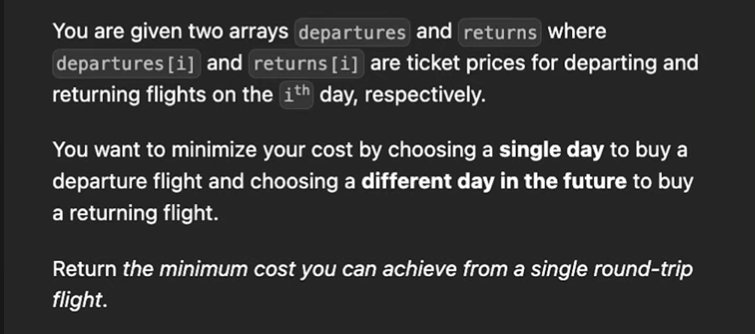

# 121. Best Time to Buy and Sell Stock

## Problem Statement

> You are given an array `prices` where `prices[i]` is the price of a given stock on the i<sup>th</sup> day.
>
> You want to maximize your profit by choosing a single day to buy one stock and choosing a different day in the future to sell that stock.
>
> Return the maximum profit you can achieve from this transaction. If you cannot achieve any profit, return 0.

> Constraints:
>
> - 1 <= prices.length <= 10<sup>5</sup>
> - 0 <= prices[i] <= 10<sup>4</sup>

## Examples

Example 1:

```
Input: prices = [7, 1, 5, 3, 6, 4]
Output: 5
Explanation: Buy on day 2 (price = 1) and sell on day 5 (price = 6), profit = 6-1 = 5.
Note that buying on day 2 and selling on day 1 is not allowed because you must buy before you sell.
```

Example 2:

```
Input: prices = [7, 6, 4, 3, 1]
Output: 0
Explanation: In this case, no transactions are done and the max profit = 0.
```

## Brute Force Solution

```
Input:
prices =
[7, 1, 5, 3, 6, 4]

For each pair (i, j) where 0 <= i < j < len(prices), find maximum profit
```

## Two Pointer Solution

```
Input:
prices =
 0  1  2  3  4  5
[7, 1, 5, 3, 6, 4]
 l
    r       * profit = -6 => price_r < price_l => l = r

 0  1  2  3  4  5
[7, 1, 5, 3, 6, 4]
    l
       r    * profit = 4 => price_l is low => increment r

 0  1  2  3  4  5
[7, 1, 5, 3, 6, 4]
    l
          r     * profit = 2

 0  1  2  3  4  5
[7, 1, 5, 3, 6, 4]
    l
             r      * profit = 5

Output: 5
```

## Meta Variation (Departures/Returns)



## References

- https://www.youtube.com/watch?v=1zfHUTVli4Q&ab_channel=CodingwithMinmer
