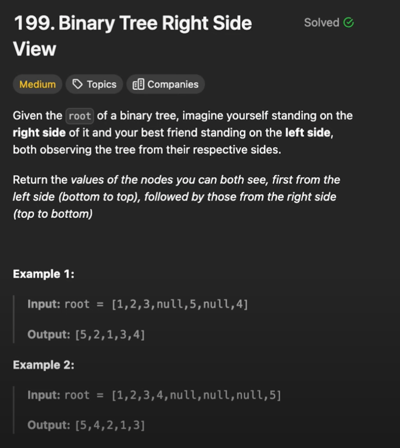

# 199. Binary Tree Right Side View

## Problem Statement

> Given the root of a binary tree, imagine yourself standing on the right side of it, return the values of the nodes you can see ordered from top to bottom.
> Constraints:
>
> - The number of nodes in the tree is in the range [0, 100].
> - -100 <= Node.val <= 100

## Examples

```
Input:
        1
       /  \
      2    3            <==
       \     \
        5     4

Output: [1, 3, 4]
```

## Breadth-First/Level Order Traversal

```
Example 1:

Input:
    1
Output: [1]

--------------------------------

Example 2:

Input:
    1
  /
 2

Output: [1, 2]

--------------------------------

Example 2:

Input:
    1
  /   \
 2     3

Output: [1, 3]

* In each level, only the right most node is visible

--------------------------------

Example 2:

Input:
             1*
           /   \
          2     3
         / \   / \
        4   5 6   7
           /
          8

queue = [(1, 0)] ->
res = []

---------------

queue = [(3, 1), (2, 1)]
        0
res = [[1]]

---------------

queue = [(5, 2), (4, 2), (3, 1)]
        0    1
res = [[1], [2]]

---------------

queue = [(7, 2), (6, 2), (5, 2), (4, 2)]
        0      1
res = [[1], [2, 3]]

---------------

queue = [(7, 2), (6, 2), (5, 2)]
        0      1     2
res = [[1], [2, 3], [4]]

---------------

queue = [(8, 3), (7, 2), (6, 2)]
        0      1       2
res = [[1], [2, 3], [4, 5]]

---------------

queue = [(8, 3), (7, 2)]
        0      1        2
res = [[1], [2, 3], [4, 5, 6]]

---------------

queue = [(8, 3)]
        0      1         2
res = [[1], [2, 3], [4, 5, 6, 7]]

---------------

queue = []
        0      1         2         3
res = [[1], [2, 3], [4, 5, 6, 7], [8]]

---------------

Output: [1, 3, 7, 8]


* Level-order traversal of the tree (BFS) from left to right
* Return the right most node value
```

## Variation: Left Side and Right Side View (Clockwise)


