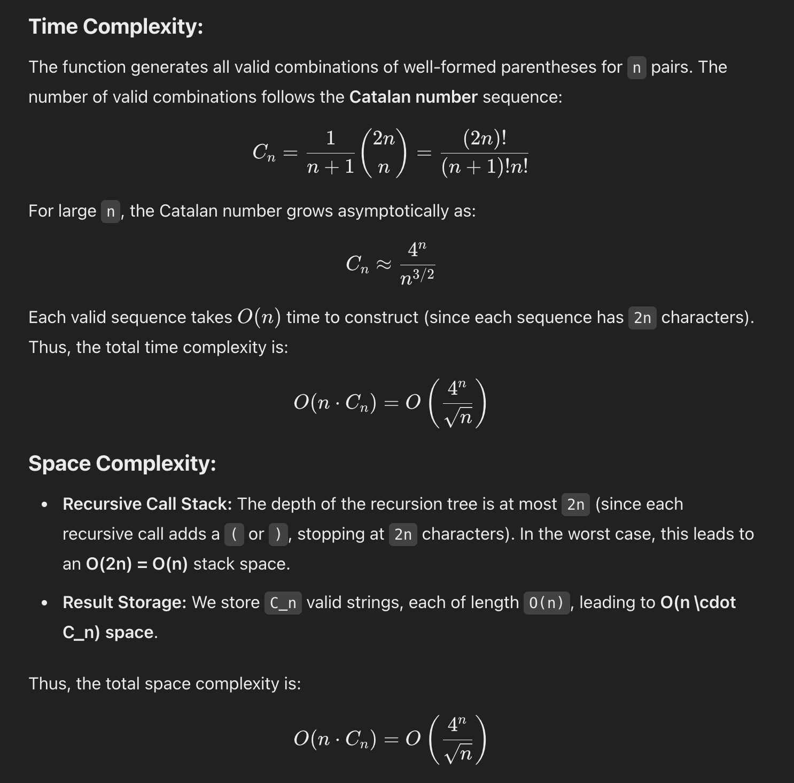

# 22. Generate Parentheses

## Problem Statement

> Given n pairs of parentheses, write a function to generate all combinations of well-formed parentheses.

> Constraints:
>
> - 1 <= n <= 8

## Examples

Example 1:

```
Input: n = 3
Output: ["((()))","(()())","(())()","()(())","()()()"]
```

Example 2:

```
Input: n = 1
Output: ["()"]
```

## Backtracking Solution

```
Input:
n = 1

")("    -> invalid since close parenthesis comes before open
"()"    -> valid

Rule:
We are only allowed to add a closing parenthesis
if count of closing parentheses is LESS than count of open parenthesis
```

```
Input:
n = 3

                    [open, close = 0, 0]
                            ""
                         /
  [open, close = 1, 0] "("
                       /   \
[open, close = 2, 0] "(("    "()" [open, close = 1, 1]
                      |
[open, close = 3, 0] "((("
                        * can not add more "(" since open == n
                        \
                        "((()" [open, close = 3, 1]
                          \
                        "((())" [open, close = 3, 2]
                            \
                         "((()))" [open, close = 3, 3]
                                * add to res, since open == close == n or len(cur_string == 2 * n)
```

```
Backtracking Template:

n = 1 ()
n = 2 (()), ()()
n = 3 ((())), (()()), , ()(()), (())(), ()()()

-> length of each is 2 * n -> n open n close

Our Choice -> Open a bracket or close a bracket
Our Constraints -> 1. cannot close until we open. 2. n count of open brackets
Our Goal -> n*2 is length of any correct answer n = 1 () -> 2n length
```

## Time and Space Complexity



## References

- https://www.youtube.com/watch?v=sz1qaKt0KGQ&ab_channel=BackToBackSWE
