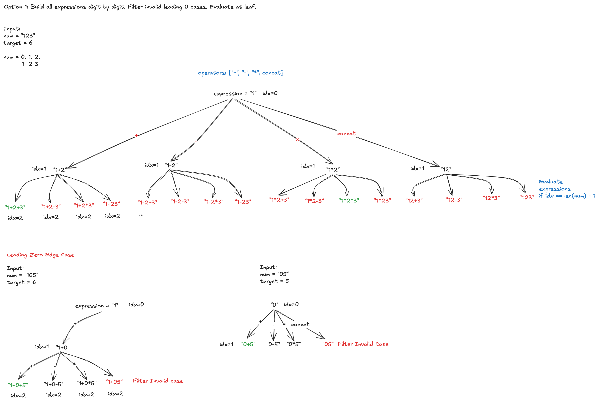
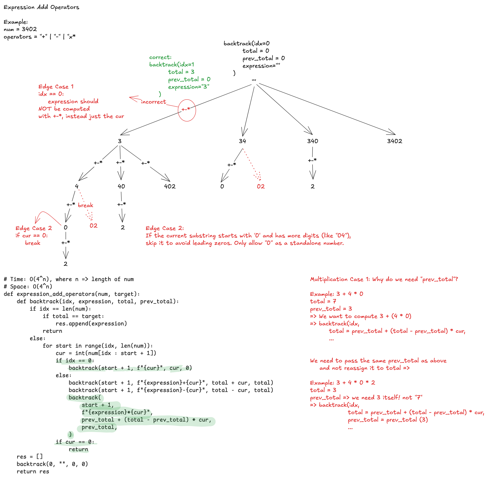

# 282. Expression Add Operators

## Problem Statement

> Given a string num that contains only digits and an integer target, return all possibilities to insert the binary operators '+', '-', and/or '\*' between the digits of num so that the resultant expression evaluates to the target value.
> Note that operands in the returned expressions should not contain leading zeros.

> Constraints:
>
> - 1 <= num.length <= 10
> - num consists of only digits.
> - -2<sup>31</sup> <= target <= 2<sup>31</sup> - 1

## Examples

Example 1:

```
Input: num = "123", target = 6
Output: ["1*2*3","1+2+3"]
Explanation: Both "1*2*3" and "1+2+3" evaluate to 6.
```

Example 2:

```
Input: num = "232", target = 8
Output: ["2*3+2","2+3*2"]
Explanation: Both "2*3+2" and "2+3*2" evaluate to 8.
```

Example 3:

```
Input: num = "3456237490", target = 9191
Output: []
Explanation: There are no expressions that can be created from "3456237490" to evaluate to 9191.
```

## Approach 1



**1. How it works**:

- Starts with the first digit as expression.
- At each step, appends the next digit with `+`, `-`, `*`, or without an operator (concatenation).
- Once all digits are used, it evaluates the expression using `eval()`.
- If the expression equals target, it is added to res.

**2. Key Observations:**

- It constructs expressions digit by digit.
- Uses `eval()` at leaf nodes, making it inefficient.
- Has an implicit base case to prevent invalid leading zeros.
- Generates invalid expressions that are later filtered out.

**3. Complexity Analysis:**

- The recursion tree has 3 branches per digit (`+`, `-`, `*`).
- If we ignore concatenation, complexity is roughly `O(3ⁿ * n)` (where n is the length of num).
- `eval()` makes it slower due to redundant computations.

**Leading Zero Handling**

```
if (idx == 0 and expression[0] == "0") or (
    idx > 0 and expression[-1] == "0" and expression[-2] in "+-*"
):
    return
```

How it Works:

- First Condition (`idx == 0 and expression[0] == "0"`)
  - Ensures that the first number can be "0" but not "05", "003", etc.
- Second Condition (`idx > 0 and expression[-1] == "0" and expression[-2] in "+-\*"`)
  - Prevents invalid numbers like "1+05" by ensuring that a "0" at the end is only part of a single-digit number.

This works because digits are added one at a time, so we need to check right before concatenation.

## Approach 2



**1. How it works:**

- Instead of constructing expressions digit by digit, it tries **all possible numbers** starting at idx.
- It maintains running totals:
  - `total` (current computed value)
  - `prev_total` (previous computation before last operation)
  - At each step, it applies `+`, `-`, or `*` without `eval()`, using direct arithmetic.
  - Avoids invalid numbers by stopping when a leading 0 is encountered.

**2. Key Observations:**

- Constructs numbers and applies operators in a structured way.
- Avoids `eval()`, making it more efficient.
- Uses `prev_total` to correctly compute multiplication.
- Ensures leading zeros (`"05"`, `"003"`, etc.) are not formed.

**3. Complexity Analysis:**

- Each recursion splits into 3 branches per operator, but the numbers also form substrings `O(n)`.
- Complexity is `O(4ⁿ)` in the worst case (since it explores different number formations).
- More optimized than eval()-based approach.

**Leading Zero Handling**

```
if cur == 0:
    return
```

How it Works:

- Stops recursion immediately when `cur == 0`.
- This prevents `"05"`, `"003"`, etc., from ever being formed.
- Since this approach extracts entire numbers (rather than single digits), we only need to check at the start of a new number.

This works because numbers are built first before applying operators, so leading zeros are naturally eliminated early.

**Handling Multiplication in Approach 2**

Multiplication requires special handling because it has a higher precedence than addition and subtraction. Unlike `+` and `-`, which can be directly applied to total, multiplication must modify the last computed value while preserving the overall expression evaluation.

**Key Idea**:
When processing an operator like `*`, we need to **undo** the last addition/subtraction and replace it with the correct multiplication result.

**How it Works**:
Each recursive call keeps track of:

- `total`: The running total so far.
- `prev_total`: The value before the last operator, needed for multiplication correction.

**Example 1: Handling `1 + 5 * 7`**

1. Suppose we have `"1+5"`, so:

- `total = 6`
- `prev_total = 1`

1. Now we want to append `*7`, meaning `1 + 5 * 7`.

- Since `*` has higher precedence, we must modify total by removing 5 and replacing it with 5 \* 7.

```
new_total = prev_total + (total - prev_total) * 7
```

- Breakdown: - `(total - prev_total) = (6 - 1) = 5` (the last number added) - `5 * 7 = 35` - `prev_total + 35 = 1 + 35 = 36`

- Pass this to the next recursion.

**Example 2: Handling `1 + 5 * 6 * 7`**

1. Suppose we already computed "1+5\*6", so:

- `total = 31` (since `1 + (5*6) = 31`)
- `prev_total = 1`

2. Now we want to do `1 + 5*6*7`.

- Again, we use:

```
new_total = prev_total + (total - prev_total) * 7
```

- Breakdown:
  `(total - prev_total) = (31 - 1) = 30` (the last computed product)
  `30 * 7 = 210`
  `prev*total + 210 = 1 + 210 = 211`

- Here, `prev_total` remains the same (`1`) across recursive calls because it represents the sum before the first multiplication.

**Code Implementation:**

```
backtrack(
    start + 1,
    f"{expression}*{cur}",
    prev_total + (total - prev_total) * cur,
    prev_total,
)
```

**Example Recursive Calls Expansion**

```
backtrack(idx, expression, total, prev_total) =>

- backtrack(0, "", 0, 0)
  - backtrack(1, "1", 1, 1)
    - backtrack(2, "1+2", 3, 2)
      - backtrack(3, "1+2+3", 6, 3) ✅ (Target Found)
      - backtrack(3, "1+2-3", 0, -3)
      - backtrack(3, "1+2*3", 7, 6)
    - backtrack(2, "1-2", -1, -2)
      - backtrack(3, "1-2+3", 2, 3)
      - backtrack(3, "1-2-3", -4, -3)
      - backtrack(3, "1-2*3", -5, -6)
    - backtrack(2, "1*2", 2, 2)
      - backtrack(3, "1*2+3", 5, 3)
      - backtrack(3, "1*2-3", -1, -3)
      - backtrack(3, "1*2*3", 6, 6) ✅ (Target Found)
    - backtrack(1, "12", 12, 12)
      - backtrack(3, "12+3", 15, 3)
      - backtrack(3, "12-3", 9, -3)
      - backtrack(3, "12*3", 36, 36)
    - backtrack(1, "123", 123, 123)
```
