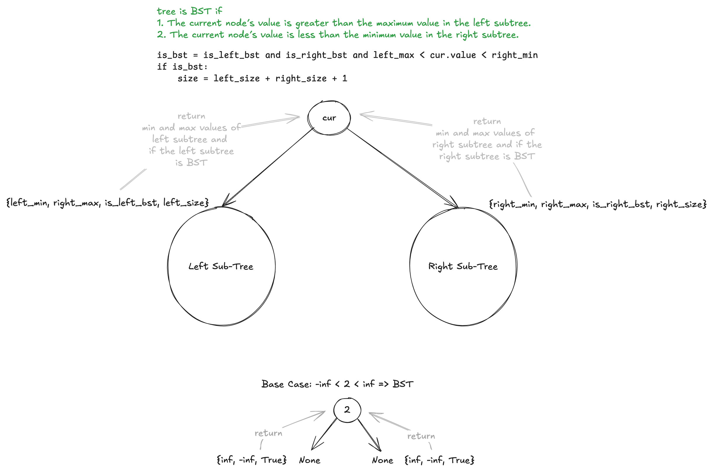

# 333. Largest BST Subtree

## Problem Statement

> Given the root of a binary tree, find the largest subtree, which is also a Binary Search Tree (BST), where the largest means subtree has the largest number of nodes.

> A Binary Search Tree (BST) is a tree in which all the nodes follow the below-mentioned properties:
>
> - The left subtree values are less than the value of their parent (root) node's value.
> - The right subtree values are greater than the value of their parent (root) node's value.
>
> Note: A subtree must include all of its descendants.

> Constraints:
>
> - The number of nodes in the tree is in the range [0, 104].
> - -10<sup>4</sup> <= Node.val <= 10<sup>4</sup>

## Examples

Example 1:


```
Input: root = [10,5,15,1,8,null,7]
Output: 3
Explanation: The Largest BST Subtree in this case is the highlighted one. The return value is the subtree's size, which is 3.
```

Example 2:

```
Input: root = [4,2,7,2,3,5,null,2,null,null,null,null,null,1]
Output: 2
```

## Solution


