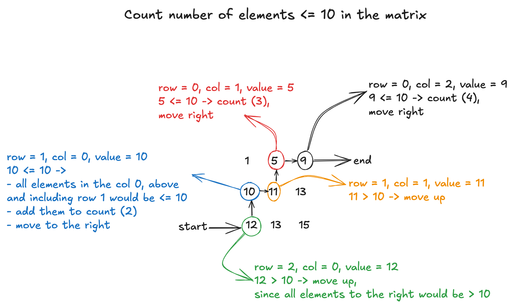

# 378. Kth Smallest Element in a Sorted Matrix

## Problem Statement

> Given an n x n matrix where each of the rows and columns is sorted in ascending order, return the kth smallest element in the matrix.
>
> Note that it is the kth smallest element in the sorted order, not the kth distinct element.
>
> You must find a solution with a memory complexity better than O(n^2).

## Examples

Example 1:

```
Input: matrix = [[1,5,9],[10,11,13],[12,13,15]], k = 8
Output: 13
Explanation: The elements in the matrix are [1,5,9,10,11,12,13,13,15], and the 8th smallest number is 13
```

Example 2:

```
Input: matrix = [[-5]], k = 1
Output: -5
```

## Binary Search Solution



1. Binary Search on Values:

- Perform binary search on the values in the `matrix` (`from matrix[0][0] to matrix[-1][-1]`).
  For each mid value, use `count_of_elements_lte(mid)` to determine how many elements in the `matrix` are less than or equal to `mid`.

2. Count Function (`count_of_elements_lte(mid, matrix)`):

- Start at the bottom-left corner of the `matrix`.
- Traverse upwards if the element is greater than `mid`; traverse right if the element is less than or equal to `mid`.
- Count how many elements are less than or equal to `mid`.

3. Binary Search Logic:

- If `count_of_elements_lte(mid) >= k`, adjust `hi = mid` (search for smaller values).
- If `count_of_elements_lte(mid) < k`, `adjust lo = mid + 1` (search for larger values).
