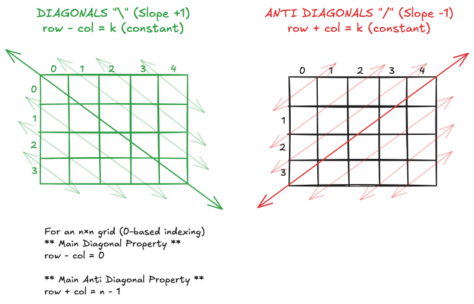

# Coding Interviews Prep

> This repository is a collection of solutions to coding problems sourced from platforms like Leetcode, InterviewBit, Pramp, and more. It serves as a comprehensive resource to systematically prepare for coding interviews, providing clean, well-documented solutions and patterns that frequently appear in technical interviews.
>
> The solutions are designed to improve problem-solving skills and familiarity with common coding challenges, covering topics such as algorithms, data structures, system design, and optimization techniques.

## MMR (Minimum Memory Requirement)

> This section focuses on critical code snippets with syntax that can be easily forgotten under pressure during interviews. By memorizing these minimal yet essential patterns, you can avoid small syntactic mistakes and speed up implementation during coding challenges.

#### Diagonal Properties of Matrix



#### ASCII Letters

```
UPPER CASE LETTERS                  LOWER CASE LETTERS
A → 65                              a → 97
B → 66                              b → 98
C → 67                              c → 99
D → 68                              d → 100
E → 69                              e → 101
F → 70                              f → 102
G → 71                              g → 103
H → 72                              h → 104
I → 73                              i → 105
J → 74                              j → 106
K → 75                              k → 107
L → 76                              l → 108
M → 77                              m → 109
N → 78                              n → 110
O → 79                              o → 111
P → 80                              p → 112
Q → 81                              q → 113
R → 82                              r → 114
S → 83                              s → 115
T → 84                              t → 116
U → 85                              u → 117
V → 86                              v → 118
W → 87                              w → 119
X → 88                              x → 120
Y → 89                              y → 121
Z → 90                              z → 122
```

- To find ASCII value of uppercase from ASCII value of lowercase: `uppercase_ascii = lowercase_ascii - 32`
- To find ASCII value of lowercase from ASCII value of uppercase: `lowercase_ascii = uppercase_ascii + 32`

#### Binary Numbers

```
0       0000

1       0001

          * (MSB)
2       0010
3       0011

         *
4       0100
5       0101
6       0110
7       0111

        *
8       1000
9       1001
...

Note:
- Most significant bit shifts at numbers [1, 2, 4, 8, 16, 32...]
- The remaining bits to the right repeat with the above offsets
```

#### Intrinsic String Methods:

- `isalnum()`: Returns True if all characters are alphanumeric (letters and digits).

```
"abc123".isalnum() # True
```

- `isalpha()`: Returns True if all characters are alphabetic (letters only).

```
"abc".isalpha() # True
```

- `isdigit()`: Returns True if all characters are digits. (Works only for positive numbers)

```
"123".isdigit() # True
```

- `strip("-").isdigit()`: Returns True if all characters are digits (Works for both positive and negative numbers)

```
"-4".strip("-").isdigit() # True
```

- `islower()`: Returns True if all cased characters are lowercase.

```
"abc".islower() # True
```

- `lower()`: Converts a character or string to lowercase.

```
'A'.lower()  # 'a'
```

- `isupper()`: Returns True if all cased characters are uppercase.

```
"ABC".isupper() # True
```

- `upper()`: Converts a character or string to uppercase.

```
'a'.upper()  # 'A'
```

- `istitle()`: Returns True if the string follows title case (first letter of each word is capitalized).

```
"Hello World".istitle() # True
```

- `isspace()`: Returns True if all characters are whitespace.

```
" ".isspace() # True
```

- `isdecimal()`: Returns True if all characters are decimal characters (0-9, used in digit-based numbers).

```
"123".isdecimal() # True
```

- `isnumeric()`: Returns True if all characters are numeric (includes digits and characters like fractions).

```
"½".isnumeric()  # True
```

- `isascii()`: Returns True if all characters are ASCII (in the range of 0-127).

```
"abc123".isascii()  # True
```

- `ljust`: Returns a left-justified version of the string in a field of a specified width. If the original string is shorter than the given width, it pads the string on the right with a specified fill character (default is a space).

```
> "hello".ljust(10)      # "hello     "
> "42".ljust(5, '0')     # "42000"
```

#### `string` Module

`import string`

- `string.ascii_letters`: Concatenation of lowercase and uppercase letters. ('abcdefghijklmnopqrstuvwxyzABCDEFGHIJKLMNOPQRSTUVWXYZ')
- `string.ascii_lowercase`: Lowercase letters ('abcdefghijklmnopqrstuvwxyz').
- `string.ascii_uppercase`: Uppercase letters ('ABCDEFGHIJKLMNOPQRSTUVWXYZ').
- `string.digits`: The digits '0123456789'.
- `string.hexdigits`: Hexadecimal digits ('0123456789abcdefABCDEF').
- `string.octdigits`: Octal digits ('01234567').
- `string.punctuation`: String of punctuation characters.
- `string.printable`: Combination of digits, letters, punctuation, and whitespace.
- `string.whitespace`: Characters considered as whitespace.

#### f-strings

F-strings provide a way to format strings using embedded expressions, introduced in Python 3.6.

```
# Syntax:

f"some text {expression}"
```

```
# Basic Example:

name = "Alice"
age = 30
greeting = f"My name is {name} and I am {age} years old."
# Output: "My name is Alice and I am 30 years old."
```

```
# Formatting Numbers:

pi = 3.14159
formatted_pi = f"Pi to 2 decimal places: {pi:.2f}"
# Output: "Pi to 2 decimal places: 3.14"
```

```
# Padding

h = 5
m = 7
time = f"{h}:{m:02d}"
# Output: "5:07"

Breakdown of :02d:
0: Pads the number with leading zeros if it's less than 2 digits.
2: Specifies the total width (2 digits).
d: Stands for decimal, ensuring the value is treated as an integer.
```

#### `heapq` Module

```
import heapq

# Basic min-heap operations
heap = []
heapq.heappush(heap, 10)
heapq.heappush(heap, 1)
heapq.heappush(heap, 5)
smallest = heapq.heappop(heap)  # Pops the smallest

# Convert list to heap
data = [10, 5, 7, 9, 3]
heapq.heapify(data)

# Find n largest/smallest elements
largest = heapq.nlargest(3, data)
smallest = heapq.nsmallest(2, data)

# Max-heap simulation (store negatives)
max_heap = []
heapq.heappush(max_heap, -10)
largest = -heapq.heappop(max_heap)

# Merge sorted lists
merged = list(heapq.merge([1, 4, 7], [2, 5, 6], [3, 8, 9]))

# Priority queue (push with priority)
priority_queue = []
heapq.heappush(priority_queue, (2, "low"))
heapq.heappush(priority_queue, (1, "high"))
task = heapq.heappop(priority_queue)
```

#### `bin()` Function

The `bin()` function converts an integer to its binary representation as a **string**.

```
# Convert integer to binary
bin_rep = bin(10)  # '0b1010'

# Convert Back to Integer:
integer = int('1010', 2)  # 10
```

#### `ord()` Function

The ord() function converts a character into its numeric ASCII value. For example, `ord('a')` returns `97`.

#### `chr()` Function

The `chr()` function converts numeric value back to a character, returning the letter.

#### Most Frequent Key Based on Value in Python Dictionary (Shorthand)

1. Single Most Frequent Key

```
most_frequent_key = max(my_dict, key=my_dict.get)
```

2. All Keys with Maximum Value

```
most_frequent_keys = [k for k, v in my_dict.items() if v == max(my_dict.values())]
```

#### Python 3 Division Operators

1. True Division (/): Always returns a float, even for integer operands.

```
Example:
print(5 / 2) # 2.5
print(-5 / 2) # -2.5 (No rounding towards 0)
```

2. Floor Division (//): Rounds down (towards negative infinity).

```
Example:
print(5 // 2) # 2
print(-5 // 2) # -3 (Not -2)
```

3. `math.ceil` Rounding Towards positive infinity

```
math.ceil(5 / 2)  # Output: 3
math.ceil(-5 / 2)  # Output: -2
```

4. Rounding Towards Zero: Use int() to truncate instead of floor rounding.

```
Example:
print(int(5 / 2)) # 2
print(int(-5 / 2)) # -2
```

#### Custom Sorting Intervals:

```
def custom_sort(intervals):
    return sorted(intervals, key=lambda x: x[0])

# Example usage
sorted_intervals = custom_sort([[7, 10], [2, 4]])
print(sorted_intervals)
# Output: [[2, 4], [7, 10]]
```

#### Binary Search Decision Table

**Using the Table: Edge Case Behavior**

- **Empty Array (`arr = []`):**

  - Exact Value Search: returns **-1**
  - First Occurrence: returns **-1**
  - Last Occurrence: returns **-1**

- **Target Lower than `nums[0]` (e.g. `arr = [1,2,3,4,5]`, target = 0):**

  - Exact Value Search: returns **-1**
  - First Occurrence: converges to index 0, but since `arr[0] ≠ 0`, returns **-1**
  - Last Occurrence: candidate becomes **-1**, so returns **-1**

- **Target Greater than `nums[-1]` (e.g. `arr = [1,2,3,4,5]`, target = 6):**

  - Exact Value Search: returns **-1**
  - First Occurrence: converges to index equal to `len(arr)`; fails the check, returns **-1**
  - Last Occurrence: candidate becomes `len(arr) - 1` (index 4), but since `arr[4] ≠ 6`, returns **-1**

- **Target Not in Array but Within Range (e.g. `arr = [1,2,4,5]`, target = 3):**

  - Exact Value Search: returns **-1**
  - First Occurrence: converges to index 2 (value 4), fails check (`4 ≠ 3`), returns **-1**
  - Last Occurrence: candidate becomes index 1 (value 2), fails check (`2 ≠ 3`), returns **-1**

- **First Occurrence:**  
  The algorithm converges to the index of the first element that is greater than or equal to the target. So if the target isn’t in the array, that index is where the first element larger than the target sits. In other words, if you were to insert the target, it would be inserted at that position (i.e. to the left of the number just greater than the target).

- **Last Occurrence:**  
  The algorithm converges to the position right after the last element that is less than or equal to the target. So if the target isn’t present, the candidate index is one more than the index of the largest element smaller than the target. Effectively, if you were to insert the target, it would be placed at that candidate index, meaning it would fall on the right side of the number just less than the target.

| **Problem Type**                            | **Initial Values (lo, hi)** | **Loop Condition** | **Condition at mid**  | **Action**   | **Return Value / Post-Processing**                              |
| ------------------------------------------- | --------------------------- | ------------------ | --------------------- | ------------ | --------------------------------------------------------------- |
| **Exact Value Search**                      | lo = 0, hi = len(arr) - 1   | while lo <= hi     | if arr[mid] == target | return mid   | If not found, return -1                                         |
|                                             |                             |                    | if arr[mid] > target  | hi = mid - 1 |                                                                 |
|                                             |                             |                    | if arr[mid] < target  | lo = mid + 1 |                                                                 |
| **First Occurrence (Lower Bound)**          | lo = 0, hi = len(arr)       | while lo < hi      | if arr[mid] >= target | hi = mid     | Return lo if lo < len(arr) and arr[lo] == target, else -1       |
|                                             |                             |                    | if arr[mid] < target  | lo = mid + 1 |                                                                 |
| **Last Occurrence (via Upper Bound)**       | lo = 0, hi = len(arr)       | while lo < hi      | if arr[mid] > target  | hi = mid     | Return lo - 1 if lo - 1 >= 0 and arr[lo - 1] == target, else -1 |
|                                             |                             |                    | if arr[mid] <= target | lo = mid + 1 |                                                                 |
| **Threshold (Smallest x where f(x)==True)** | lo = 0, hi = len(arr)       | while lo < hi      | if f(mid) is True     | hi = mid     | Return lo (with f(lo)==True, assuming valid answer exists)      |
|                                             |                             |                    | if f(mid) is False    | lo = mid + 1 |                                                                 |

#### Summary of Monotonic Stack Behavior:

```

Problem          |  Traversal Direction  |   Stack
-------------------------------------------------------
Next Greater     |  Left to Right        |   Decreasing
Previous Greater |  Right to Left        |   Decreasing
Next Smaller     |  Left to Right        |   Increasing
Previous Smaller |  Right to Left        |   Increasing
```

#### Subarrays vs Subsequences

- Subarray: Contiguous portion of an array.

  - Example: [1, 2, 3] → [1], [1, 2], [2, 3], etc.
  - Count: n \* (n + 1) / 2.

- Subsequence: Sequence from the array by deleting any number of elements while maintaining order.

  - Example: [1, 2, 3] → [1], [2], [1, 3], etc.
  - Count: 2^n.

```
def compute_subarrays(nums):
    return [nums[i:j+1] for i in range(len(nums)) for j in range(i, len(nums))]

-----------------------------------------------------------------------------

from itertools import combinations
def compute_subsequences(nums):
    return [list(comb) for i in range(len(nums)+1) for comb in combinations(nums, i)]
```

#### Zip Method

```
list1 = [1, 2, 3]
list2 = ['a', 'b', 'c']
zipped = zip(list1, list2)
print(list(zipped)) # Output: [(1, 'a'), (2, 'b'), (3, 'c')]

list1 = ["cat", "dog", "dog"]
my_string = "abb"
zipped = zip(list1, my_string)
print(list(zipped)) # Output: [("cat", 'a'), ("dog", 'b'), ("dog", 'c')]

list1 = [1, 2, 3]
list2 = ['a', 'b']
zipped = zip(list1, list2)
print(list(zipped)) # Output: [(1, 'a'), (2, 'b')]

tuple1 = (1, 2, 3)
tuple2 = ('a', 'b', 'c')
zipped = zip(tuple1, tuple2)
print(list(zipped)) # Output: [(1, 'a'), (2, 'b'), (3, 'c')]
```

#### Character Frequency Counting Using a Fixed-Size Array

When dealing with problems where characters are strictly lowercase ('a'-'z') or strictly uppercase ('A'-'Z'), we can efficiently count occurrences using a fixed-size array of length 26.

```
# Lowercase Letters ('a'-'z'):
counts = [0] * 26
for char in s:
    counts[ord(char) - ord('a')] += 1
```

```
# Uppercase Letters ('A'-'Z')
counts = [0] * 26
for char in s:
    counts[ord(char) - ord('A')] += 1
```

This technique ensures O(1) space and O(n) time complexity, making it optimal for frequency-based string problems

#### Check for Overlapping Intervals

Two intervals overlap if:

1. The start of one interval is less than the end of the other.
2. This condition needs to be true for both intervals.

Condition: Two intervals `[start1, end1)` and `[start2, end2)` overlap if: `start1 < end2 and start2 < end1`

```
# This assumes that intervals are half-open: [start, end), meaning end is not included in the interval.

def is_overlapping(current, given):
    return current[0] < given[1] and given[0] < current[1]
```

```
# This assumes that intervals are fully closed: [start, end], meaning end is included.

def is_overlapping(current, given):
    return current[0] <= given[1] and given[0] <= current[1]
```

#### Sweeping Line Algorithm (Intervals Problems)

1. **Transforming the Problem into Events**

   - **Step:** Convert each interval or event into discrete events.
   - **Example:** For a meeting or life span, represent the start (birth or meeting start) and end (death or meeting end) as separate events.

2. **Sorting the Events**

   - **Step:** Sort all events by their key value (time, x-coordinate, etc.).
   - **Tie-breaking:** When two events have the same value, decide the order—typically processing “end” events before “start” events helps reuse resources (like meeting rooms).

3. **Sweeping Through the Events**

   - **Step:** Conceptually move a “sweeping line” through the sorted events.
   - **Update State:**
     - When encountering a “start” event, update your state (e.g., increment the active count).
     - When encountering an “end” event, update your state (e.g., decrement the active count).

4. **Tracking the Result**
   - **Step:** As you update the state, track the metric of interest (for example, the maximum count reached).
   - **Example:** The maximum number of overlapping intervals directly answers problems like “minimum number of meeting rooms required” or “maximum population at a time.”

**Problems Solved Using the Sweeping Line Algorithm**

- **Meeting Room Scheduling:**  
  Determine the minimum number of conference rooms required by calculating the maximum number of concurrent meetings.

- **Maximum Population Problem:**  
  Given birth and death dates, find the time when the population is at its highest by tracking the net increase (births) and decrease (deaths) over time.

- **Interval Overlap and Intersection:**  
  Calculate the total number of overlapping intervals or detect intersections among segments.

#### Random Library in Python

```
import random

# Selecting a Random Element from a List:
random_item = random.choice(my_list)

# Generating a Random Integer Between Two Values (Inclusive):
random_int = random.randint(a, b)

# Shuffling a List in Place:
random.shuffle(my_list)

# Generating a Random Float Between 0 and 1:
random_float = random.random()
```

#### Counter Module

```
from collections import Counter

my_list = [1, 2, 3, 2, 1, 4, 5, 1]
counter = Counter(my_list)
=> Counter({1: 3, 2: 2, 3: 1, 4: 1, 5: 1})

my_string = "hello world"
counter = Counter(my_string)
=> Counter({'h': 1, 'e': 1, 'l': 3, 'o': 2, ' ': 1, 'w': 1, 'r': 1, 'd': 1})

my_tuple = (1, 2, 3, 1, 2)
counter = Counter(my_tuple)
=> Counter({1: 2, 2: 2, 3: 1})
```

#### SortedList in Python (`sortedcontainers` Library)

SortedList is a dynamically sorted list that maintains order automatically and supports fast insertions, deletions, and lookups.

Key Operations & Time Complexity

- Insert (`add`): `O(log n)`
- Delete (`remove`): `O(log n)`
- Indexing (`sl[i]`): `O(1)`

```
from sortedcontainers import SortedList

> sl = SortedList([5, 3, 8, 1])
> sl.add(4) # Inserts 4 in sorted order
> sl.remove(3) # Removes 3
> print(sl[0]) # Output: 1 (smallest)
> print(sl[-1]) # Output: 8 (largest)
```

#### Definition of Binary Tree Node

```
class BTNode:
    def __init__(self, value):
        self.left = None
        self.right = None
        self.value = value
```

#### Definition of Singly Linked List Node

```
class SLLNode:
    def __init__(self, value):
        self.next = None
        self.value = value
```

**Hashing SLLNode for Use in a Dictionary**

To store SLLNode objects as keys in a hash map (dictionary), you need to define both the `__hash__` and `__eq__` methods:

Note: The `__eq__` method is called a "dunder method" (short for "double underscore method") or "special method" in Python. More specifically, it is known as a "magic method" because it is automatically invoked by Python when using the == operator.

`__hash__`: Determines the hash value of an object. It should return a unique value based on the object's identity (e.g., id(self)).

```
def __hash__(self):
    return id(self)  # Hash by object identity
```

`__eq__`: Defines the equality comparison between two SLLNode objects. This method is called when comparing nodes to check if they are structurally the same (i.e., same value).

```
def __eq__(self, other):
    if not isinstance(other, SLLNode):
        return False
    return self.value == other.value  # Compare values
```

These methods enable proper usage of SLLNode as dictionary keys, allowing for efficient key-based lookups and proper comparisons.

#### Definition of Doubly Linked List Node

```
class DLLNode:
    def __init__(self, value):
        self.prev = None
        self.next = None
        self.value = value
```

#### Unit Testing in Python3

```
import unittest

class TestSomething(unittest.TestCase):
    def test_some_function(self):
        self.assertEqual(some_function(input), expected_output)
```
