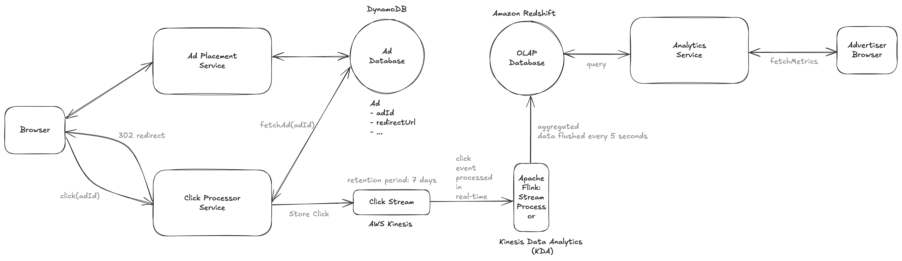
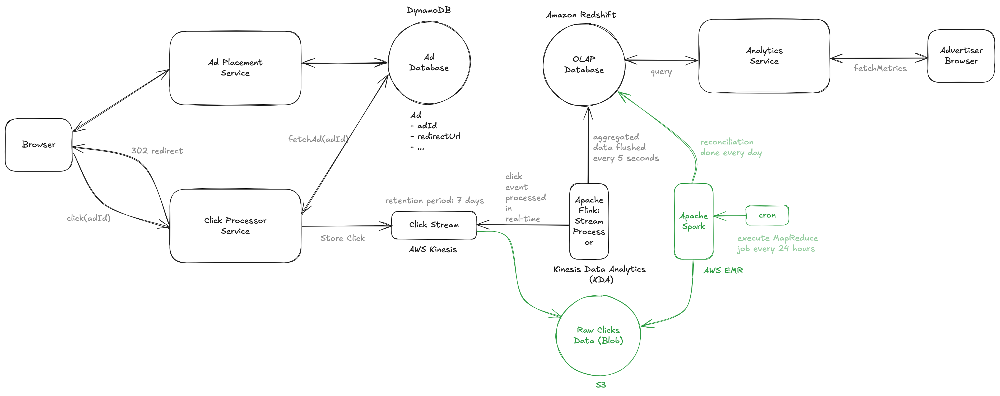

# Ad Click Aggregator

> An Ad Click Aggregator is a system that collects and aggregates data on ad clicks.
> It is used by advertisers to track the performance of their ads and optimize their campaigns.
> For our purposes, we will assume these are ads displayed on a website or app, like Facebook.

## Important Points to Remember (Flashcard)

1. Functional Requirements: Track clicks and provide analytics with minimum granularity of 1 min.
2. Scale: Support 10M ads, 10K clicks/sec peak, 100M clicks/day.
3. Key Components: Browser → Click Processor Service → Kinesis Stream → Flink (KDA) → Redshift OLAP.
4. Fault Tolerance: Data reconciliation via Apache Spark from raw S3 data every 24 hours.
5. Idempotency: Use signed unique impression IDs and distributed cache for deduplication.
6. Real-Time Analytics: Flink flushes data to Redshift every 5 seconds; Advertisers query metrics with <1s latency.
7. Scaling Kinesis: Shard on adId, dynamically repartition hot shards to handle hot shards.
8. Slow Queries Fix: Nightly pre-aggregation cron job for large time-window queries.
9. Retention: Kinesis retains stream data for up to 7 days to support fault tolerance.

---

## Functional Requirements

1. Users redirected to ad page when they click ad.
2. Advertisers can query ad click metrics over time with a minimum granularity of 1 min.

---

## Scale Estimations

1. 10M active ads
2. Peak of 10K clicks/s
3. Total number of clicks/day = 100M clicks/day

---

## Non Functional Requirements

1. Scalable to support 10K clicks/second.
2. Low latency analytics queries for advertisers (< 1s).
3. Fault tolerant and accurate data collections (System should not lose click data).
4. As realtime as possible, advertisers should be able to query data as soon as possible after the click.
5. Idempotent click tracking (system should not count the same click multiple times)

---

## System Interface

1. Input: Ad click data from users.
2. Output: Ad click metrics for advertisers.

---

## Data Flow

1. User clicks on ad.
2. Click is tracked and persisted in the system.
3. User is redirected to ad page.
4. Advertiser queries the system for aggregated click metrics.

---

## High Level Design

**Steps**:

1. Click Event Received → Clicks are sent to Kinesis Streams in real-time.
2. Flink Reads Events → Flink continuously pulls data from Kinesis.
3. Flink Maintains a Count → It keeps a running count of clicks per adId.
4. 5-Second Window Ends → Flink flushes the partial aggregation to OLAP.
5. OLAP Stores Data → The database stores 5s aggregated counts.
6. Final 1-Min Aggregation → Either Flink or OLAP rolls up data for 1-minute reporting.
7. Advertisers Query Data → They get near real-time analytics with 1-minute granularity.

---

## Deep Dive 1 (Fault Tolerance) - Reconciliation using Apache Spark

**Problem**: Discrepancies can still occur in the click data because of:

- Out of order events
- Bad code pushed to the stream pipeline
- Even small discrepancies can be costly in high-stakes environments like ad click tracking.

**Solution**:

1. AWS Kinesis:

- built-in fault tolerance, ensuring data is replicated across AZ (availability zones)
- data retention - configurable period (default 24 hours, up to 7 days)

2. Why Reconciliation Helps?

- The reconciliation process ensures that, despite all the real-time processing optimizations, the final data stored in your OLAP database is accurate.

---

## Deep Dive 2 (Idempotency) - Generate Impression ID

**Steps**:

1. Impression ID Generation: The Ad Placement Service generates a unique impression ID for each ad instance shown to a user.
2. Signing: The impression ID is signed with a secret key and sent to the browser with the ad.
3. Click Processing: When a click occurs, the browser sends the signed impression ID with the click data.
4. Verification: The Click Processor verifies the signature of the impression ID.
5. Deduplication: The Click Processor checks if the impression ID exists in a cache:
   - If it exists, the click is ignored (duplicate).
   - If it doesn't, the click is processed, and the impression ID is added to the cache.
6. Cache Scaling: Use a distributed cache (Redis Cluster or Memcached) for scalability and ensure fault tolerance with replicas and persistence.
7. Challenges: Managing cache scaling and ensuring malicious users can't spoof impression IDs.

---

## Deep Dive 3 (Query over large time windows) - Pre aggregate data in OLAP database

**Problem**:
Where this query can still be slow is when we are aggregating over larger time windows, like a days, weeks, or even years.

**Pre aggregation in OLAP**:

1. This can be done by creating a new table that stores the aggregated data at a higher level of granularity, like daily or weekly.
2. This can be via a nightly cron job that runs a query to aggregate the data and store it in the new table.

---

## Deep Dive 4 (Scaling and Handling Hot Shards)

**Problem**: AWS Kinesis Limit: 1000 records/shard or 1MB/s

Solution:

1. Shard on AdId
2. For hot shards, dynamic repartitioning (append unique key to the hot AdId)

---

## Key Technologies & Concepts

1. AWS Kinesis

- Managed service for real-time data streaming.
- Stores streaming data reliably with built-in replication across availability zones.
- Retention period is configurable (default: 24 hours, max: 7 days).
- Scales by partitioning data into "shards" (1MB/sec or 1000 records/sec per shard).
- Cost-efficient at approximately $0.015 per GB ingested.

2. Apache Flink (Kinesis Data Analytics - KDA)

- Real-time distributed stream processing engine.
- Designed for stateful computations over data streams.
- Processes each event as it arrives, unlike batch-oriented systems (Spark).
- Maintains state in memory (e.g., running total of clicks) and updates continuously.
- Flushes results to OLAP database upon window expiry (e.g., every 5 seconds).
- Flink jobs can be written in Java, Scala, or SQL.
- AWS auto-scales Kinesis and Flink to handle traffic bursts.

3. Apache Spark

- Distributed computing engine for batch and real-time stream processing.
- Provides APIs for batch processing, streaming, machine learning, and graph processing.
- Efficient due to in-memory computation, distributed execution, and lazy evaluation.
- Typically used for reconciliation by re-processing raw data.
- Can handle petabytes of data efficiently and is significantly faster than Hadoop.
- Managed through AWS EMR (Elastic MapReduce), which runs Spark on EC2 clusters.
- Costly due to high RAM usage.

4. MapReduce Job

- Programming model for processing large datasets in parallel.
- Composed of two main steps: Map (filtering and sorting) and Reduce (summarizing results).
- Ideal for batch processing and aggregating large datasets (like daily analytics jobs).
- Steps:
  - Map: Groups data (clicks) based on adId and minuteTimestamp.
  - Reduce: Counts unique clicks per ad per minute.

5. Amazon Redshift (OLAP Database)

- OLAP stands for Online Analytical Processing
- Database category designed for fast analytical queries over large datasets.
- Columnar storage optimizes aggregation and filtering.
- Precompute summaries for rapid query performance.
- Amazon Redshift:
  - Cloud-based OLAP database optimized for analytics.
  - Built on PostgreSQL, uses columnar data storage.
  - Capable of querying terabytes to petabytes of data efficiently.

6. Idempotency & Impression IDs

- Ensures each click is counted only once.
- Unique impression IDs signed with secret keys for verification.
- Distributed cache (Redis/Memcached) used for deduplication.

7. Sharding

- Data partitioning technique splitting data into smaller pieces (shards).
- Shards stored and processed on different servers or nodes for parallel execution.
- Enhances performance, scalability, and reduces latency.
- Partition key choice based on access patterns and data distribution.
- AdId is a natural partition key for independent click processing.

8. Handling Hot Shards

- Hot shard: Excessive events with one partition key causing performance issues.
- Dynamic repartitioning: Further partitions high-traffic data (e.g., Nike-LeBron-1, Nike-LeBron-2).
- Low-traffic ads remain on original shard.
