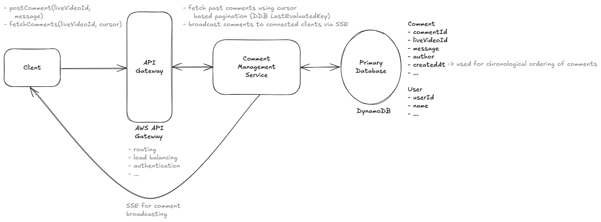
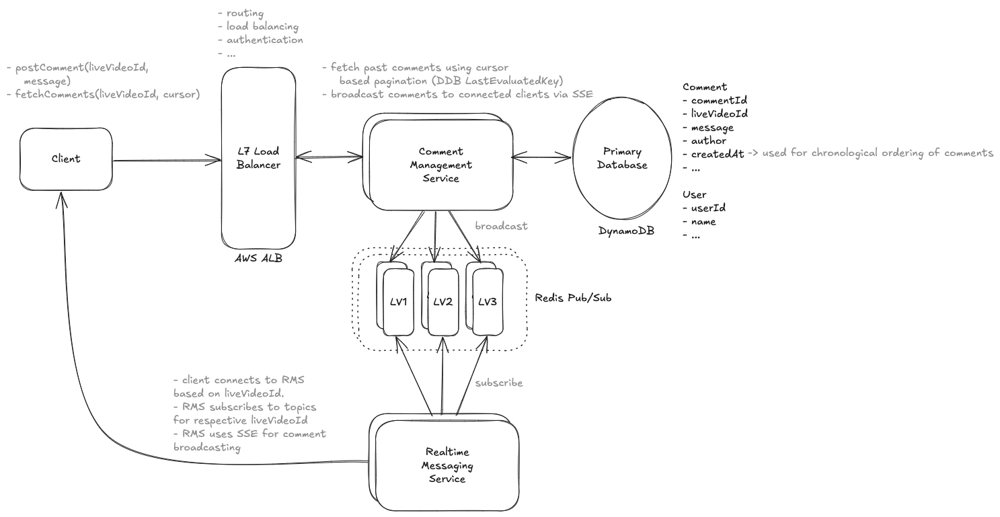

# Design Facebook's Live Comments System

> Facebook Live Comments is a feature that enables viewers to post comments on a live video feed. Viewers can see a continuous stream of comments in near-real-time.

---

## Important Points to Remember (Flashcard)

- **Functional Requirements:** Post comments, view new/old comments in real-time.
- **Scale:** 1M+ concurrent viewers, 1K+ comments/second per video.
- **Latency:** Sub-200ms real-time comment broadcasting.
- **Data Storage:** DynamoDB for simple, chronological comment storage.
- **Real-time Communication:** SSE (unidirectional) chosen over WebSockets due to simplicity and efficiency in a read-heavy scenario.
- **Scaling Challenges:** Redis Pub/Sub for horizontal server scaling and real-time message distribution.
- **Load Balancing Options:** AWS ALB (routing by liveVideoId), Zookeeper-based dynamic routing, or consistent hashing.
- **Pagination Strategy:** Cursor-based pagination with DynamoDB (LastEvaluatedKey) ensures efficient fetching of historical comments.
- **Availability vs Consistency:** System prioritizes availability for real-time comment broadcasting.

---

## Functional Requirements

1. Viewers can post comments on a live video
2. Viewers can read new comments being posted while they are watching the video
3. Viewers can read old comments posted before they joined the live feed

--- out of scope ---

1. Viewers can reply to comments
2. Viewers can react to comments

---

## Scale

1. 1M+ concurrent viewers
2. 1K + comments/second per video

---

## Non Functional Requirements

1. System should scale to support millions of live videos and thousands of comments per second per video
2. availability >> consistency
3. low latency in broadcasting comments (< 200 ms)

--- out of scope ---

1. system should be secure (only authorized users are allowed to comment)
2. system should have restrictions on comments (hate speech, etc.)

---

## Core Entities

1. Comment
2. User
3. LiveVideo

---

## APIs

1. user can post comments

```
POST /comments/:liveVideoId
body: {
    message,
}
```

2. user receives new comments in real-time

```
WebSocket /comments/:liveVideoId
header: {JWT | session token}
response: {
    commentId,
    message,
    timestamp
}
```

3. user can read older comments

```
GET /comments/:liveVideoId?lastCommentId={last_id}&page={page}&limit={limit}
```

---

## High Level Design



- SSE is perfect for our use case because it's optimized for server-to-client streaming, which matches our comment broadcast pattern.
- It's more lightweight than WebSockets since we only need one-way communication. It handles reconnection automatically, and it works over standard HTTP, making it easier to implement and maintain.
- The flow would be: when a new comment is posted, our service immediately pushes it through the established SSE connections to all viewers of that video, achieving sub-200 ms latency."

---

## Deep Dive 1 Scaling - Redis Pub/Sub with Real Time Messaging Service



Step 1: Viewer requests to open SSE connection.
Step 2: Load balancer/API Gateway routes the viewer request to the right server, typically based on liveVideoId.
Step 3: Once routed, the SSE connection remains open directly between viewer and assigned Comment Server.
Step 3: All subsequent SSE messages (comments) flow directly from that server to the viewer without further routing intervention.

---

## Key Technologies & Concepts

**DynamoDB**

- Ideal for simple comment storage without complex relationships or transactions.
- Efficient cursor-based pagination using LastEvaluatedKey.
- Queries based on liveVideoId sorted chronologically (createdAt).

**Server-Sent Events (SSE)**

- Unidirectional server-to-client communication, optimal for broadcasting comments.
- Lightweight compared to WebSockets, suitable for high read/write imbalance.
- Built on HTTP, enabling simple and robust automatic reconnection.
- Provides near real-time (< 200ms latency) comment broadcasting.

**Redis Pub/Sub**

- Enables horizontal scaling of real-time message distribution.
- Servers subscribe to topics (liveVideoId) and broadcast comments to viewers via SSE.
- Facilitates coordination among distributed comment management servers.

**Cursor Pagination**

- Utilizes unique identifiers (cursor) for efficient database querying.
- Highly performant with DynamoDB by leveraging LastEvaluatedKey.
- Stable, unaffected by new inserts or deletions during scrolling.

**Load Balancing & Intelligent Routing**

Three possible approaches:

1. **AWS Application Load Balancer (ALB)**

   - Uses routing rules based on liveVideoId (e.g., via HTTP headers or paths).
   - Ensures SSE connections for the same live video co-locate on specific servers.
   - Simplifies horizontal scaling with moderate complexity.

2. **Zookeeper (Dynamic Coordination Service)**

   - Maintains dynamic mappings (liveVideoId → server).
   - Load balancer queries Zookeeper to route requests accurately.
   - Highly flexible but operationally more complex.

3. **Consistent Hashing**
   - Distributes load evenly across servers using a hash of liveVideoId.
   - Ensures minimal disruption when adding/removing servers.
   - Provides simplicity and efficiency in horizontal scaling.

**Partitioned Pub/Sub**

- Servers handling viewers for the same live video share Pub/Sub channels.
- Guarantees consistent and efficient delivery of comments across viewers connected to different servers.
