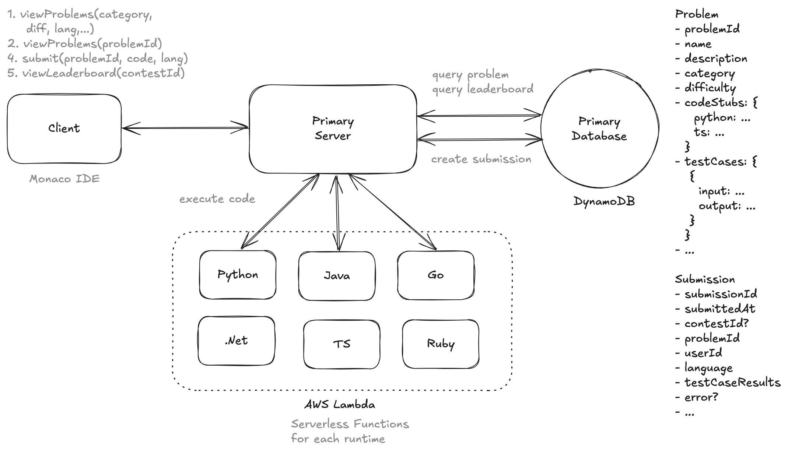
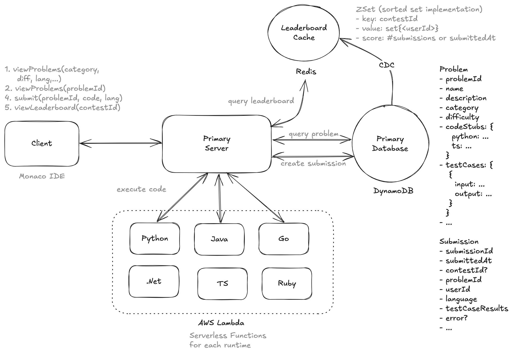
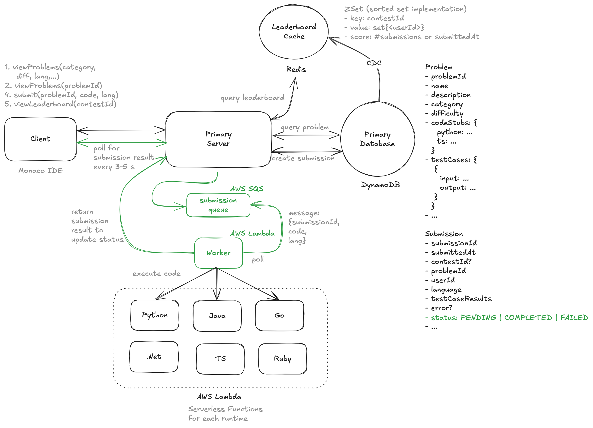

# Design Leetcode

> LeetCode is a platform that helps software engineers prepare for coding interviews. It offers a vast collection of coding problems, ranging from easy to hard, and provides a platform for users to answer questions and get feedback on their solutions. They also run periodic coding competitions.

---

## Important Points to Remember (Flashcard)

- Functional Requirements: View problems, submit code, get instant feedback, real-time leaderboards.
- Scale: ~4000 problems, contests with 100K concurrent users.
- AWS Lambda vs ECS: Chose Lambda for built-in security, auto-scaling, cost-efficiency for short-lived tasks; mitigate cold starts via provisioned concurrency.
- Lambda Constraints: Use execution timeout (e.g., 1 min) and memory limits (128MB–512MB) to control resource usage.
- Leaderboard Efficiency: Redis sorted sets (ZSet) cache for rapid leaderboard retrieval; avoids frequent expensive database queries.
- Scaling Strategy: AWS SQS queues manage incoming submissions during contests, smoothing demand spikes and improving concurrency management.
- Isolation and Security: Lambda sandbox ensures secure isolation of user code executions.

---

## Functional Requirements

1. Users view a list of problems
2. Users view a problem and code a solution in multiple languages
3. Users submit their solution and receive instant feedback
4. Users view a live leaderboard for contests/competitions

--- out of scope ---

1. authentication & profiles
2. payment
3. social features

---

## Scale

1. ~4000 coding problems
2. 100K users per competition

---

## Non Functional Requirements

1. Isolation and security when running user code
2. Low latency in returning submission results (< 5s)
3. Scale to support contests with 100K users
4. availability >> consistency

---

## Core Entities

1. Problem
2. Submission
3. Leaderboard
4. User

---

## APIs

1. View list of problems

   `GET /problems?category={category}&difficulty={difficulty}&page={page}&limit={limit} -> Partial<Problem>`

2. View a problem

   `GET /problems/:problemId -> Problem`

3. Submit solution

   ```
   POST /submissions/:problemId -> submissionId
   header: {JWT | session token} (userId)
   body: {
    code,
    language
   }
   ```

4. View leaderboard

   `GET /leaderboard/:competitionId?page={page}&limit={limit} -> Leaderboard`

---

## High Level Design



1. Verdict between AWS Lambda (Serverless Functions) v/s ECS (Docker Containers):

   **AWS Lambda**

   Pros:

   - Runs in a secure sandboxed environment per invocation.
   - Auto-scales instantly (thousands of executions in parallel).
   - Pay-per-invocation model (cheaper for sporadic workloads).
   - Needs no/less security setup (timeout/max memory configurations
     are out of box.

   Cons:

   - Cold starts and warmup issues for sporadic workloads.
   - No direct support for compiled languages like C++, Rust without additional setup.
   - Limited execution time (max 15 minutes per invocation).
   - Limited compute resources (max 10 GB RAM, 6 vCPUs).

   **AWS ECS (Docker Containers)**

   Pros:

   - No cold starts (container stays alive).
   - Can support any language since you define the runtime via Docker.

   Cons:

   - Pay for provisioned compute (better for continuous execution).
   - Needs extra security setup - timeout/memory

   Verdict:

   > I chose AWS Lambda over ECS because it provides built-in security, automatic scaling, enforced execution limits, and simplifies infrastructure management for running user-submitted code, while cold start issues can be mitigated using provisioned concurrency or keep-alive strategies if needed.

   - Use Lambda execution timeouts (e.g., 1min) to prevent infinite loops.
   - Set memory limits (e.g., 128MB–512MB) to avoid excessive resource usage.

2. Leaderboard (Polling)
   - Query Submissions table groupBy userId
   - Poll every 5 seconds to display live leaderboard

---

## Deep Dive 1: Efficiency in Fetching Leaderboard (Redis SortedSet Cache: ZSet)



```
**ZSet**
key: contestId
value: sortedset{<userId>}
score: #submissions or submittedAt
```

---

## Deep Dive 2: Scaling (Competitions with 100K users)



**Problem**:

1. Lambda can handle up to 1000 concurrent executions by default.
2. If all 100K requests come at once, and the concurrency limit is exceeded, some requests will queue, which can introduce delays and degrade user experience.

**Solution**:

1. Instead of spinning up 100K Lambdas at once, place the incoming requests in an SQS queue.
2. Lambda can then poll the queue and process messages one at a time, scaling better based on demand.
3. This also avoids overwhelming Lambda with spikes and provides better control over concurrency.

---

## Key Technologies & Concepts

1. **AWS Lambda (Serverless Functions)**

- Runs user-submitted code in isolated, secure sandbox environments.
- Automatically scales instantly (up to thousands of parallel executions).
- Cost-effective (pay-per-invocation) for short-lived workloads.
- Built-in security, execution timeouts, and memory limits.
- Execution time limit: max 15 mins per invocation; compute resources: max 10GB RAM, 6 vCPUs.

2. **AWS ECS (Docker Containers)**

- Suitable for long-running, CPU-intensive, or compiled language tasks (C++, Rust).
- Provides fine-grained control over execution environment and runtime flexibility.
- No cold starts, as containers stay alive.
- Higher costs (provisioned compute) and requires manual security setups.

3. **Redis Sorted Sets (ZSet)**

- In-memory data structure ideal for leaderboards.
- Quickly retrieves top N users based on scores or submission times.
- Reduces database load, latency, and improves scalability.

4. **AWS SQS (Simple Queue Service)**

- Fully managed message queuing service.
- Decouples requests from Lambda to smoothly handle large bursts of traffic.
- Helps manage concurrency and prevents Lambda overload.

5. **Leaderboard Efficiency**

- Avoid polling directly from the database due to high load and latency.
- Use Redis sorted sets for efficient in-memory caching and fast retrieval.
