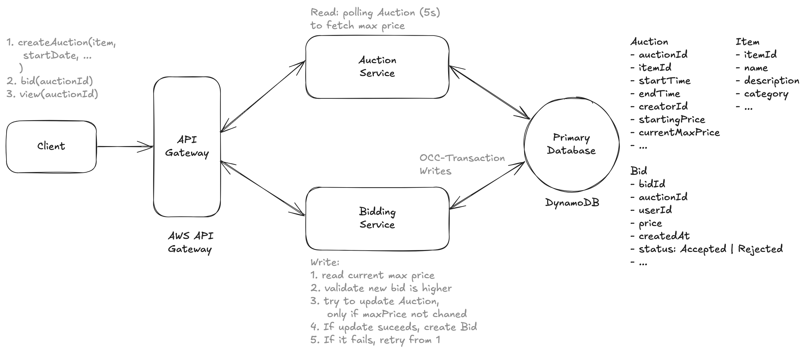
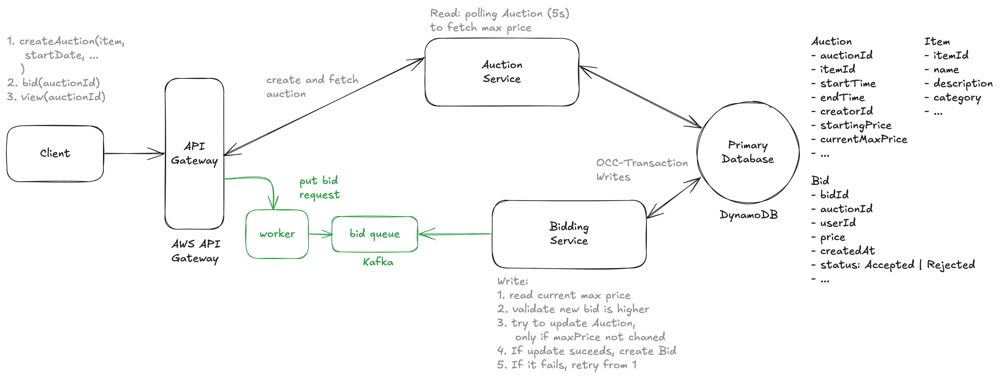
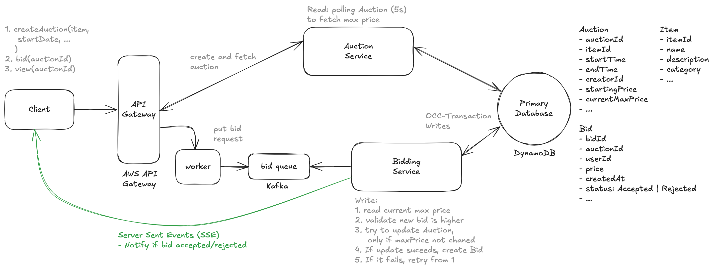
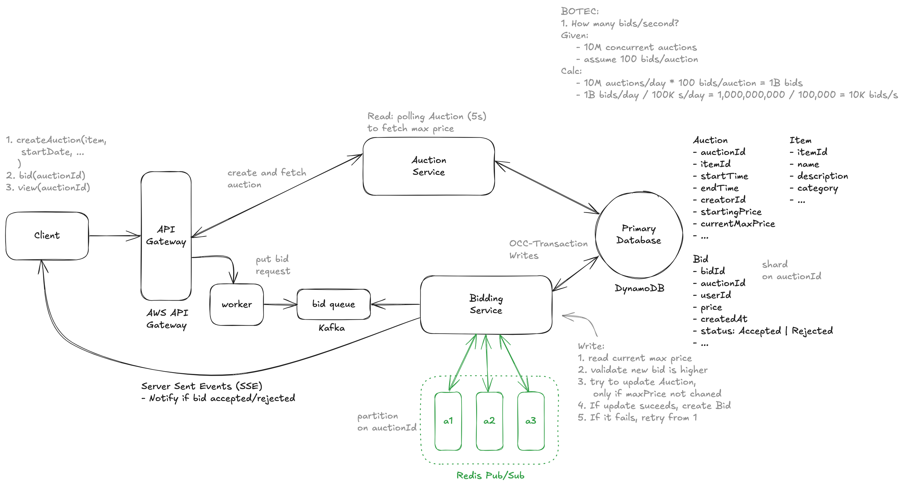

# Design an Online Auction Service Like eBay

> eBay is an online auction service that allows users to buy and sell items.

---

## Important Points to Remember (Flashcard)

- Functional Requirements: Create auctions, bid on items, view real-time highest bid.
- Scale Requirements: Support 10M concurrent auctions, ~10,000 bids/sec.
- Strong Consistency: DynamoDB conditional writes (OCC) ensure bids reflect accurate highest price.
- Fault Tolerance: Kafka ensures bids are reliably stored and processed even if bid services fail.
- Real-time Bid Updates: SSE for immediate client updates, coordinated via Pub/Sub across servers.
- Optimistic Concurrency Control (OCC): Avoids locking, uses conditional writes to manage rare write conflicts efficiently.
- Kafka vs AWS SQS: Kafka preferred for high throughput, durability, and strict message ordering.
- Scalability: Database sharding by auctionId, horizontal scaling of servers, and coordinated message broadcasting.
- SSE vs Long Polling: SSE offers real-time, lightweight, unidirectional streaming suitable for frequent server-to-client updates.
- Bid Storage Estimation: ~25TB/year manageable storage, assuming 520M auctions/year with 100 bids each.
- Infrastructure Complexity (SSE): Scaling SSE requires Pub/Sub coordination to synchronize state across multiple servers.

---

## Functional Requirements

1. Users are able to post an item for auction with starting price and end date.
2. Users should be able to bid on an item, where bids are accepted if they are higher than current price.
3. Users should be able to view an auction, including current highest bid.

--- out of scope ---

- Users should be able to search for items.
- Users should be able to view auction history of an item.

---

## Scale

1. 10M concurrent auctions

---

## Non Functional Requirements

1. Strong consistency for bids to ensure all users see the same highest current bid.
2. System should be fault tolerant (not drop bids).
3. System should show the highest current bid in real time.
4. System should scale to support 10M concurrent auctions.

---

## Core Entities

1. Auction
2. Item
3. Bid
4. User

Note: Keep Item as a separate entity:

- Items can be reused across multiple auctions (e.g. if a seller wants to relist an unsold item)
- Item details can be updated independently of auction details
- We can more easily add item-specific features like categories or search

---

## APIs

1. Create auctions

```
POST /auctions -> Auction & Item
header: {JWT | session token}
body: {
    itemId: Item
    startDate,
    endDate,
    startingPrice
}
```

2. Bid on Item

```
POST /bids/:auctionId -> Bid
{
    bidDetails
}
```

3. View Auction

```
GET /auctions/:auctionId -> Auction & Item
```

---

## High Level Design



**Notes**:

1. Microservice Architecture:
   - independent scaling: Bidding traffic is typically 100x more than auctions
2. Consistency for Bids -
   - Cache `currentMaxBidPrice` in Auction table
   - Utilize Optimistic Concurrency Control (OCC) transactions to write to Auction table for `currentMaxBidPrice`
3. Read latest `currentMaxBidPrice` - poll the Auction table every 5s (Inefficient, but we will discuss more in deep dive)

---

## Deep Dive 1: Fault Tolerance Against Dropping Bids - (Message Queue - Kafka)



**Steps**:

1. User submits a bid through our API
2. API Gateway routes to a producer which immediately writes the bid to Kafka
3. Kafka acknowledges the write, and we can tell the user their bid was received
4. The Bid Service consumes the message from Kafka at its own pace
5. If the bid is valid, it's written to the database
6. If the Bid Service fails at any point, the bid remains in Kafka and can be retried

## Deep Dive 2: Real Time Price Updates - (Server Sent Events)



**Steps**:

1. The client establishes a persistent connection (EventSource) with the server, when they call the getAuction API.
2. The server pushes updates to the client immediately when bids change.
3. Connection remains open indefinitely (or until manually closed), without regular reconnection overhead.

## Deep Dive 3: Scaling - Shard on `auctionId`



**BOTEC**:

1. How many bids per second?

- Given:
  - 10M concurrent auctions
  - assume 100 bids per auction
- Calculation
  - 10M auctions/day \* 100 bids/auction = 1B bids/day
  - 1B bids/day / 100K second/day = 1,000,000,000 / 100,000 = 10,000 bids/second
- Implications:
  - Solution: shard primary database based on `auctionId`

2. Storage Estimations?

- Given:
  - assume each bid is 500B
  - 10M concurrent auctions with 100 bids per auction
  - assume auction runs for a week
- Calculation:
  - 52 weeks in a year = 520M auctions/year
  - 520M auction/year \* 100 bids/auction = 52B bids/year
  - 50B bid/year \* 500 byte/bid = 25TB
- Implications:
  - 25TB storage per year is manageable

**Sharding SSE**:

How Pub/Sub solves this:

- Pub/Sub (publish-subscribe) provides a scalable mechanism for broadcasting messages between servers.
- Each server subscribes to channels (e.g., specific auctions) and can receive broadcasted messages from other servers.

Here’s the step-by-step flow:

1. Bid received - A user submits a bid → the bid is processed → the Bid Service accepts the bid and updates the database.
2. Publishing the Update: - After processing the bid, the server handling the request publishes a message to a Pub/Sub system (e.g., Kafka, Redis Pub/Sub, SNS), notifying that there's a new max bid for Auction A: `{auctionId: A, maxBid: 500, bidder: user123, timestamp: 1711120000}`
3. Message Distribution - All other Bid service instances (servers) have subscribed to the Pub/Sub channel (or topic). They receive the published message in real-time.
4. Updating the connected clients: Each server then checks if it has active SSE connections for that auction. If yes, it immediately pushes the updated bid information to its connected clients.

---

## Key Technologies & Concepts

**AWS DynamoDB & Optimistic Concurrency Control (OCC)**

- DynamoDB provides strong consistency via transactional conditional writes.
- OCC manages concurrency without heavy locking:
  - Transactions read the current data state, modify it, and conditionally write it back.
  - Version checks (timestamps or counters) prevent overwriting concurrent changes.
  - On conflict (condition fails), the transaction retries.

**Kafka (Message Queue)**

- Ensures fault tolerance and durability of bid submissions.
- Stores incoming bids immediately to prevent data loss during service outages.
- Buffers against load spikes, processing bids asynchronously.
- Guarantees message ordering within partitions to maintain fairness.
- Provides high throughput and durability over AWS SQS, especially critical for high traffic.

**Server-Sent Events (SSE)**

- Provides real-time bid price updates from server to client.
- Persistent, unidirectional HTTP-based connection.
- Simple implementation with built-in browser support (EventSource API).
- Efficient (no repeated polling or reconnection overhead).
- Scalable broadcasting via Pub/Sub solutions like Redis or Kafka.

**Sharding**

- Partition the database based on auctionId to handle high concurrency and scale.
- Each shard independently handles traffic, improving performance and availability.

**Pub/Sub Mechanism (Redis Pub/Sub, Kafka, SNS)**

- Enables scalable real-time bid updates across horizontally scaled servers.
- Servers publish bid updates; subscribed servers broadcast updates to connected SSE clients.
- Essential for synchronizing event broadcasting across multiple server instances.
