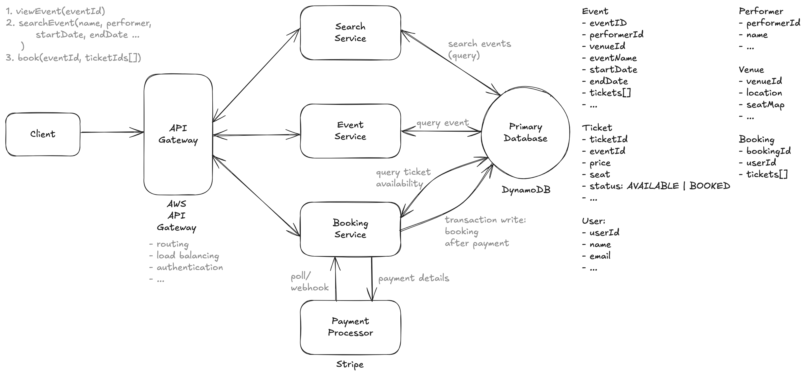
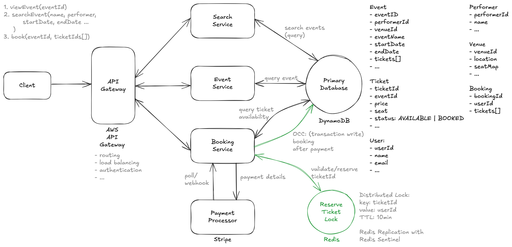
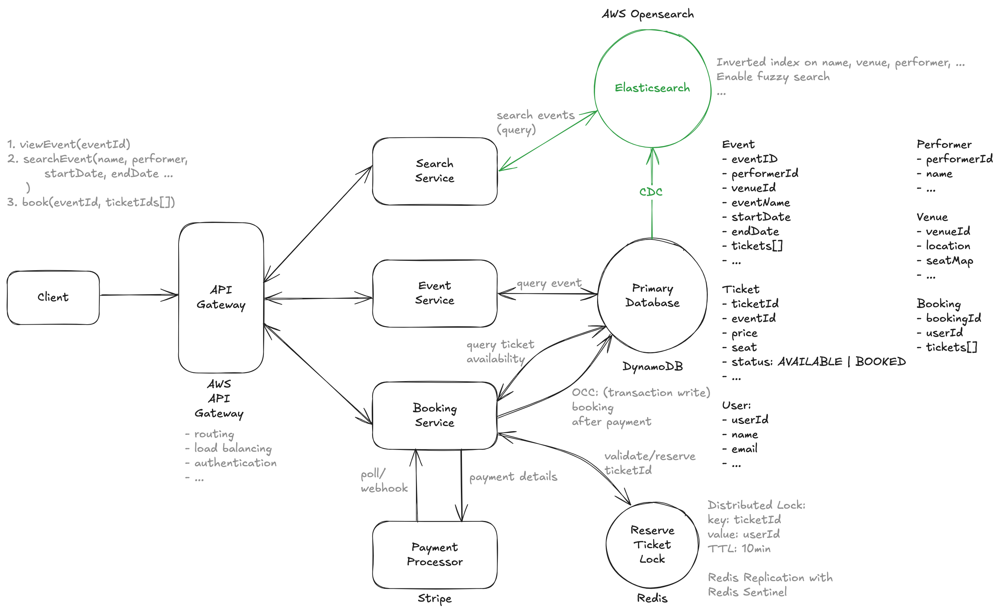
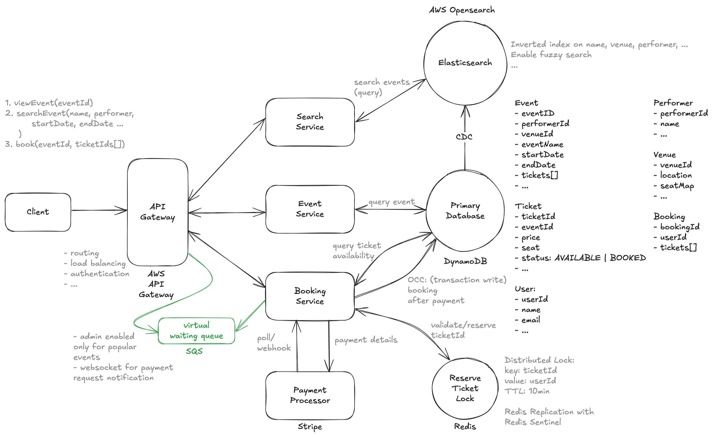

# Design Ticketmaster

> Ticketmaster is an online platform that allows users to purchase tickets for concerts, sports events, theater, and other live entertainment.

---

## Important Points to Remember (Flashcard)

- Functional Requirements: View events, search events, book tickets.
- Scale Requirements: Support high-demand events (~10M users/event), 100:1 read-heavy workload.
- Consistency Priority: DynamoDB with transactional writes and reads ensures ticket-booking consistency.
- Reservation System: Redis distributed lock prevents ticket conflicts; locks tickets temporarily during payment.
- Low Latency Search: Elasticsearch via inverted index for efficient search.
- High-Demand Event Handling: Virtual queue with WebSocket communication prevents seat-map staleness.
- Caching & Load Balancing: Use Redis/Memcached caches, load-balanced stateless instances, and auto-scaling for handling peak traffic.
- Payment Handling (Stripe): Webhooks preferred over polling for real-time payment updates.
- DynamoDB Transactions: Provide atomic, consistent, isolated, durable ticket booking transactions.

---

## Functional Requirements

1. Users should be able to view events.
2. Users should be able to search events based on event name, performer, venue, etc.
3. Users should be able to book tickets to events.

--- out of scope ---

1. Users should be able to view their booked events.
2. Admins or event coordinators should be able to add events.
3. Popular events should have dynamic pricing.

---

## Non Functional Requirements

1. System should prioritize consistency in booking events.
2. System should be scalable and handle high throughput in the form of popular events (10M users/event).
3. System should have low latency search (< 500ms).
4. System is read heavy; needs to support high read throughput (100: 1)

--- out of scope ---

1. System should protect user data and adhere to GDPR

---

## Core Entities

1. Event
2. Ticket
3. Booking
4. Performer
5. Venue
6. User

---

## APIs

1. Users view events

   `GET /events/:eventId -> Event & Performer & Venue & Ticket[]`

2. Users search events

   `GET /events/search?keyword={keyword}&start={start_date}&end={end_date}&page={page}&limit={limit} -> Partial<Event>`

3. Users book events

   ```
   POST /bookings/:eventId -> bookingId
   body: {
       ticketIds[],
       paymentDetails,
   }
   ```

---

## High Level Design



**Booking Service Steps (Transaction Write)**: The booking server initiates a transaction to

1. Check the availability of the selected tickets.
2. Transaction write the status of the selected Tickets to “booked”.
3. Create a new booking record in the Bookings table.

---

## Deep Dive 1 (Reservation System - Redis Distributed Lock)



**Problem**: The current solution, while it technically works, results in a horrible user experience. No one wants to spend 5 minutes filling out a payment form only to find out the tickets they wanted are no longer available because someone else typed their credit card info faster.

**Solution**:

- Steps:

  1. When a user selects a ticket, set a Redis lock (ticketId -> userId) with a TTL (e.g., 10 min).
  2. The Redis lock prevents others from selecting the same ticket while payment is in progress.
  3. When payment is confirmed, perform a DynamoDB `TransactWriteItems`

- DynamoDB Optimistic Concurrency Control (OCC) to handle race condition:

  When a user reserves a ticket, you can use a conditional check in TransactWriteItems to ensure that:

  1. The ticket is still available (status = 'available').
  2. If the ticket is still available, update it to booked.

- Redis Crash:
  1. Redis provides high availability by using Redis Replication and Sentinel.
  2. Redis Replication: You set up one primary Redis instance and multiple replicas.
  3. Redis Sentinel: Monitors Redis instances and automatically promotes a replica to primary if the primary fails.

---

## Deep Dive 2 Low Latency for Search



**Problem**: DynamoDB’s query and scan operations are limited for complex text searches. Searching for partial matches, typos, or relevance-based ranking is difficult with DDB alone.

**Solution**:

1. Use Elasticsearch to handle full-text searches efficiently with inverted indexes.
2. Implement Change Data Capture (CDC) from PostgreSQL to Elasticsearch for real-time updates.

---

## Deep Dive 3 (Booking for High Demand Events - Admin Enabled Virtual Waiting Queue)



**Problem**: With popular events, the loaded seat map will go stale quickly. Users will grow frustrated as they repeatedly click on a seat, only to find out it has already been booked. We need to ensure that the seat map is always up to date and that users are notified of changes in real-time.

**Solution**

1. Place users in a virtual waiting queue before they access the booking page.
2. Establish a WebSocket connection to track each user in the queue.
3. Dequeue users gradually based on system capacity and ticket availability.
4. Notify users via WebSocket when they can proceed to book.

---

## Deep Dive 4 Scaling to support 10s of millions of requests (Caching/Load Balancing)

**Problem**: In our non-functional requirements we mentioned that our view and search paths need to be highly available, including during peak traffic scenarios.

**Solution**:

1. Caching for Read Optimization
   - Use Redis/Memcached to store high-read, low-update data like event details, venue info, and performer bios.
   - Implement a read-through cache strategy to reduce direct database hits, with TTL policies for periodic refresh.
2. Cache Invalidation & Consistency
   - Set up database triggers or event-driven updates to notify the cache of changes, ensuring stale data is evicted.
   - Use shorter TTLs for frequently updated data like event availability.
3. Load Balancing & Horizontal Scaling
   - Deploy multiple stateless instances of the Event Service behind a load balancer (e.g., ALB/NLB).
   - Use Round Robin or Least Connections to evenly distribute traffic and ensure high availability.
4. Scaling Challenges & Management
   - Use auto-scaling to handle traffic spikes dynamically.
   - Implement graceful deployments and rollback strategies to minimize downtime and maintain system stability.

---

## Key Technologies & Concepts

1. **AWS DynamoDB**

- NoSQL database providing scalable, high-performance storage.
- Supports ACID properties for transactions:
  - Atomicity: Transactions are all-or-nothing.
  - Consistency: Uses transactional writes (TransactWriteItems) and reads (TransactReadItems).
  - Isolation: Serializable isolation ensures transactions appear sequential.
  - Durability: Ensures data persistence.
  - Ideal for consistent, fast updates like ticket booking.

2. **Redis (Distributed Locking & Caching)**

- Used for real-time ticket reservation via distributed locks.
- Locks tickets temporarily during the payment process to avoid double booking.
- Provides high availability with Redis Replication (primary/replicas) and Redis Sentinel (automatic failover).
- Caches frequently accessed data (event details, venue information, performer bios) to reduce database load.

3. **Elasticsearch (Full-text Search)**

- Handles complex, low-latency searches with inverted indexes.
- Efficiently supports partial matches, typos, relevance-based ranking.
- Uses CDC (Change Data Capture) from PostgreSQL for real-time synchronization.

4. **Payment Processing (Stripe)**

- Payment integration via Stripe APIs (PaymentIntent or Charge API).
- Processes payments asynchronously:
- Webhooks: Stripe notifies backend of payment status changes.
- Polling: Backend periodically queries Stripe’s API to check payment status.

5. **Virtual Waiting Queue (High-Demand Events)**

- Manages large user volume and ensures updated seat maps.
- Users placed in a queue, served gradually based on system capacity.
- WebSocket connections notify users in real-time when it's their turn to book.

6. **Scaling & Load Balancing**

- Use Redis/Memcached caches for optimized read performance.
- Read-through cache strategy with TTL for freshness.
- Cache invalidation triggered by database changes or events.
- Stateless event service instances behind load balancer (ALB/NLB).
- Auto-scaling for dynamic traffic management and high availability.
