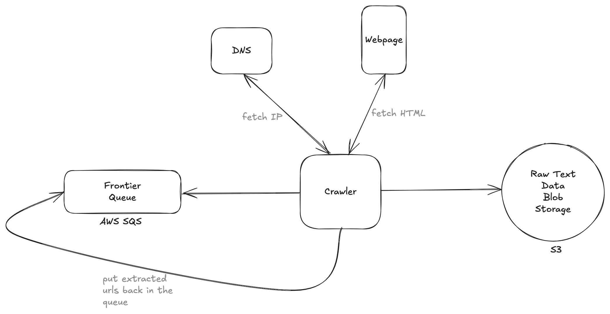
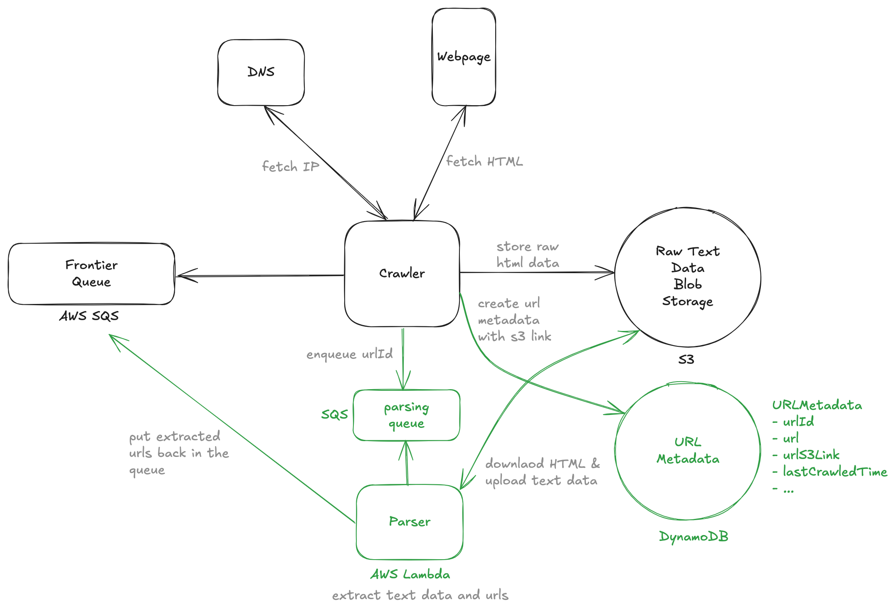

# Design a Web Crawler

> A web crawler is a program that automatically traverses the web by downloading web pages and following links from one page to another. It is used to index the web for search engines, collect data for research, or monitor websites for changes.

---

## Important Points to Remember (Flashcard)

- Functional Requirements: Crawl URLs, extract/store text, discover new URLs.
- Scale Requirements: 10B pages (~20PB), completion within 5 days.
- Fault Tolerance: AWS SQS with exponential backoff, DLQ for persistent failures.
- Data Storage: Large data in Blob storage (S3), metadata tracking in relational/NoSQL DB.
- Queue Management: SQS for automatic retries; Kafka as alternative for precise log-based recovery.
- Politeness: Adhere to robots.txt, enforce crawl delays, track crawl timestamps.
- Worker Robustness: Queues ensure processing continuity despite worker failures.
- Pipeline Flexibility: Modular pipeline stages ease scaling and updates.
- DNS Optimization: Local caching and scalable DNS solutions essential to avoid bottlenecks.

---

## Functional Requirements

1. Crawl the web, given a set of seed urls
2. Store the text data on each webpage for later processing

--- out of scope ---

- actual processing of data
- handling of non text data
- handling of authentication

---

## Scale

1. Total webpages: 10B
2. Average page size: 2MB
3. Crawling should be completed within 5 days

---

## Non Functional Requirements

1. Fault tolerance in handling errors gracefully, and not losing progress
2. Politeness to adhere to `robots.txt` and not overload website servers inappropriately
3. Efficient to crawl web pages within 5 days
4. Scalable to handle 10B pages

---

## System Interface

1. Input: Set of seed urls
2. Output: text data extracted from all crawled webpages

---

## Data Flow

1. Take a seed url from the frontier set and fetch its IP from DNS
2. Fetch HTML content for the webpage
3. Extract text data from the webpage and store it
4. Extract any urls and add them back to the list of urls to crawl
5. Repeat steps 1-4 until no urls left to parse

---

## High Level Design



---

## Deep Dive 1: Fault Tolerance - (Message Queue with Parser)



---

## Deep Dive 2 Politeness: `robots.txt`

```
Example robots.txt file:
User-agent: *
Disallow: /private/
Crawl-delay: 10

- User-agent means which crawler this rule applies to? \* means all.
- Disallow let's us know which pages the crawler is not supposed to crawl
- line specifies how many seconds the crawler should wait between requests (in this case 10s)
```

**Steps**:

1. Download robots.txt file per domain once
2. Store parsed directives Disallow, Crawl-delay in URLMetadata
3. Check before crawling; if url is disallowed skip url OR enforce specified crawl delay
4. Enforcing crawl delay: Track the last crawl timestamp per domain, requeue URL with delay

> "We can store domain metadata in a Redis instance alongside our crawlers. When a URL is first pulled, we'll make a request to Redis to see if the robots.txt has already been pulled. If it hasn't, we'll pull it and push it back into Redis. We'll use Redis like a rate limiter for our crawling by incrementing a key associated with the domain. If the number of requests for the past second exceeds a number (e.g. 10), we'll wait until the next second to proceed."

---

## Deep Dive 3: Scalability - Estimate number of servers required for 5 days crawl (4-5)

**BOTEC**

1. How many days would it take for a single server to parse 10B pages

- Given:

  - Typical AWS server bandwidth: 400 Gbps (Gigabits/sec)
  - In practice, it is 25% of this so 100 Gbps
  - 10B pages on web
  - page ~ 2MB

- Calculations
  - 100Gbps = 100 Gbits/second / 8bit/byte ~ 10GB/s
  - 10 GB/s / 2MB/page = 10,000,000,000 / 2,000,000 = 10K page/s
  - 10B pages / 10K pages/s = 1M seconds
  - 1M s / 100K s/day = 10 days
- Implications: It takes 10 days for a single server to crawl the web => let's provision around ~5 servers

**DNS Bottleneck**

- DNS is one potential bottleneck that is often overlooked.
- If we're using a 3rd party DNS provider, we'll want to make sure they can handle the load.
- We can cache DNS lookups in our crawlers to reduce the number of DNS requests we need to make.

---

## Key Technologies & Concepts

**High-Level Pipeline Stages**

- URL Fetching: Retrieve HTML content.
- Text & URL Extraction: Parse text data and extract new URLs.
- Independent stages ensure robustness and scalability.

**Fault Tolerance & Robustness**

- Web fetching commonly fails due to connection issues, slow responses, or server errors.
- AWS SQS manages retries with exponential backoff (e.g., 30s → 2min → 5min, capped at ~15min).
- After 5 retries, URLs are sent to a Dead-Letter Queue (DLQ).
- Pipeline isolation allows independent task retries without systemic impact.

**Storage Strategy**

- Blob Storage (S3): Store large HTML or text content efficiently.
- Metadata DB (DynamoDB, MySQL, PostgreSQL): Track crawl progress, URL status, and store blob references.
- Queue contains lightweight references (IDs), not heavy payloads.

**Queueing and State Management**

1. AWS SQS:

- Ensures single consumer per message (visibility timeout).
- Explicit deletion upon successful processing.
- Automatic message re-delivery if processing fails.

2. Apache Kafka (Alternative):

- Messages persist as logs, enabling precise recovery from failures.
- Workers resume processing exactly where failure occurred.

**Worker Failure Handling**

- Queue retains messages until successful processing.
- New workers seamlessly replace failed workers without data loss.

**Flexibility and Maintainability**

- Separation into stages allows independent scaling and optimization.
- Easy integration of modifications or new logic (e.g., ML-based text extraction).

**Politeness & Robots.txt**

- Politeness: Limits crawl frequency to avoid server overload.
- Robots.txt: Specifies permissions (Disallow) and crawl rate (Crawl-delay).
- Process:
  - Periodically download and parse robots.txt per domain.
  - Store directives in metadata.
  - Enforce directives before crawling URLs.
  - Track last-crawled timestamp per domain to enforce crawl delays.

**Scalability Considerations**

- Bandwidth Estimation:

  - 10B pages @ 2MB each = ~20PB data.
  - Single server (~100Gbps effective bandwidth) handles ~10K pages/sec, requiring ~10 days.
  - Approximately 5 servers required to crawl in 5 days.

- DNS Bottleneck:

  - Cache DNS results locally.
  - Verify DNS provider scalability.
