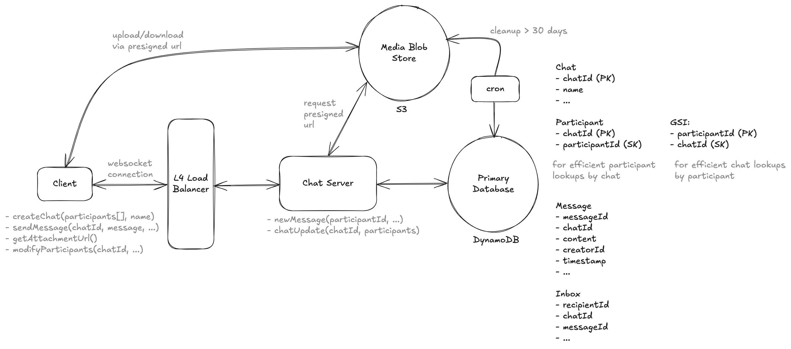
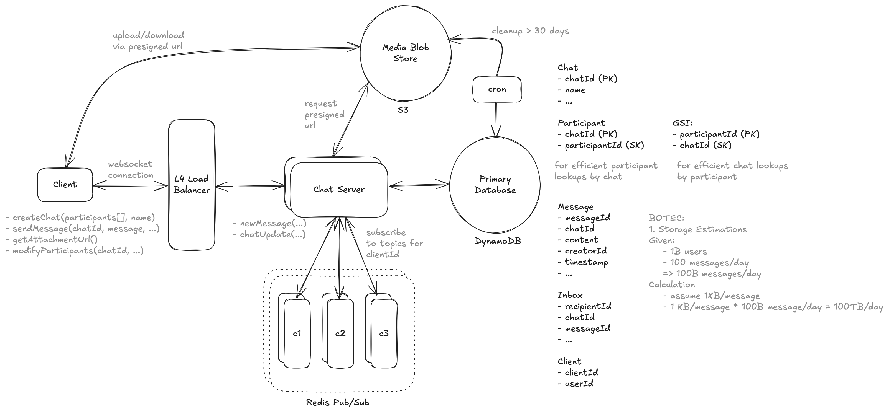

# Design Whatsapp

> Whatsapp is a messaging service that allows users to send and receive encrypted messages and calls from their phones and computers. Whatsapp was famously originally built on Erlang (no longer!) and renowned for handling high scale with limited engineering and infrastructure outlay.

---

## Important Points to Remember (Flashcard)

- Functional Requirements: Group chats (max 100 users), send/receive messages, offline message storage (30 days), media attachments.
- Scale: Billions of users, high throughput, low latency message delivery (<500ms).
- System Interface: Bidirectional WebSocket for real-time messaging.
- Data Storage: DynamoDB for chats/messages; S3 for media storage.
- Real-time Messaging: WebSocket connections managed via Redis Pub/Sub for scalability.
- Load Balancing: L4 load balancers efficiently handle persistent WebSocket connections.
- Message Delivery Guarantee: Inbox table temporarily stores messages for offline users.
- Fault Tolerance: Redis Pub/Sub and message inbox ensure reliable message delivery despite transient failures.

---

## Functional Requirements

1. Users should be able to start group chat with multiple participants (limit 100)
2. Users should be able to send/receive messages
3. Users should be able to receive messages sent while they are not online (up to 30 days)
4. Users should be able to send/receive media in their messages

--- out of scope ---

1. Audio/Video calling
2. Profile management

---

## Non Functional Requirements

1. Messages delivered with low latency (< 500 ms)
2. System should guarantee delivery of messages
3. System should handle billions of users with high throughput
4. Messages should be stored on centralized servers no longer than necessary
5. System should be fault tolerant

--- out of scope ---

1. Spam and scraping prevention systems

---

## Core Entities

1. User
2. Chat (2 - 100 users)
3. Message
4. Client (a users might have multiple devices)

---

## System Interface

We're going to have high-frequency updates being both sent and received. This is perfect use case for bi-directional socket connection.

Commands from client to server:

```
1. createChat (participants [], name) -> chatId
2. sendMessage (chatId, message, attachments) -> "SUCCESS" | "FAILURE"
3. modifyParticipants(chatId, userId, operation: "ADD" | "REMOVE") -> "SUCCESS" | "FAILURE"
```

Commands from server to clients:

```
1. chatUpdate (chatId, participants) -> "RECEIVED"
2. newMessage (chatId, userId, message, attachments) -> "RECEIVED"
```

---

## High Level Design



Creating a Chat:

1. User sends createChat() request to the service.
2. Service performs a transaction to:
   - Create a Chat record in DynamoDB.
   - Create ChatParticipant records for each participant.
3. Returns chatId to the user.

Sending a Message:

1. User sends sendMessage() to ChatServer
2. Chat server looks up all participants via the ChatParticipant table.
3. Chat servers creates a transaction:
   - Write message to Message table
   - Write an entry in Inbox table for each participant
   - newMessage() to connected clients, if ack is received delete entry from inbox
   - for not connected clients, message would reside in Inbox until they connect

Media/Attachments:

1. S3 + Presigned Url

---

## Deep Dive 1 Scalability - Redis Pub/Sub



On connection:

1. Chat server will connect to the Pub/Sub topic for that clientId
2. Any messages received on that subscription are then forwarded to the websocket connection of that client

When a message needs to be sent:

1. Chat server publishes the message to the Pub/Sub topic for relevant client
2. The messages is received by all subscribing Chat Servers
3. Those Chat servers then forward it to the client via websocket connection

> We'll need to create a new Clients table to keep track of clients by user id. When we look up participants for a chat, we'll need to look up all of the clients for that user. Chat servers will subscribe to a topic with the clientId vs the userId. When we send a message, we'll need to send it to all of the clients for that user. We'll need to update our Inbox table to be per-client rather than per-user.

---

## Key Technologies & Concepts

**DynamoDB**

- Scalable NoSQL database, suitable for high throughput.
- Transactions ensure consistency:
  - Create Chat and ChatParticipant records atomically.
  - Write messages and participant inbox entries atomically.

**AWS S3**

- Storage solution for media attachments.
- Presigned URLs used for secure upload/download of media.

**Redis Pub/Sub**

- Enables scalable message broadcasting across multiple Chat servers.
- Ensures real-time message delivery:
- Chat servers subscribe to user-specific channels.
- On message publish, all subscribing servers receive and forward messages instantly via WebSocket.

**WebSocket**

- Persistent, bidirectional connection enabling instant communication.
- Ideal for messaging, typing indicators, and live notifications.
- Reduces latency compared to HTTP polling.
- Established via HTTP handshake upgraded to WebSocket protocol.

**Layer 4 (L4) Load Balancer**

- Routes based on IP addresses and ports.
- Ideal for WebSocket connections, managing long-lived TCP connections efficiently.
- Provides low latency and overhead compared to L7 (application-layer) load balancers.
