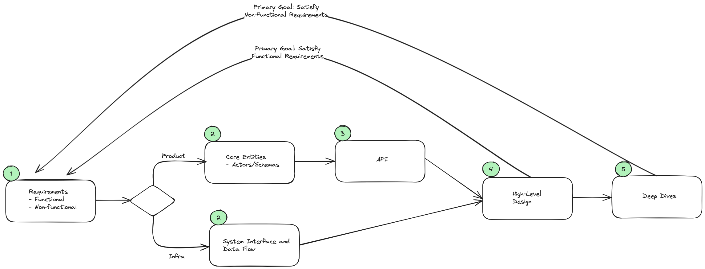
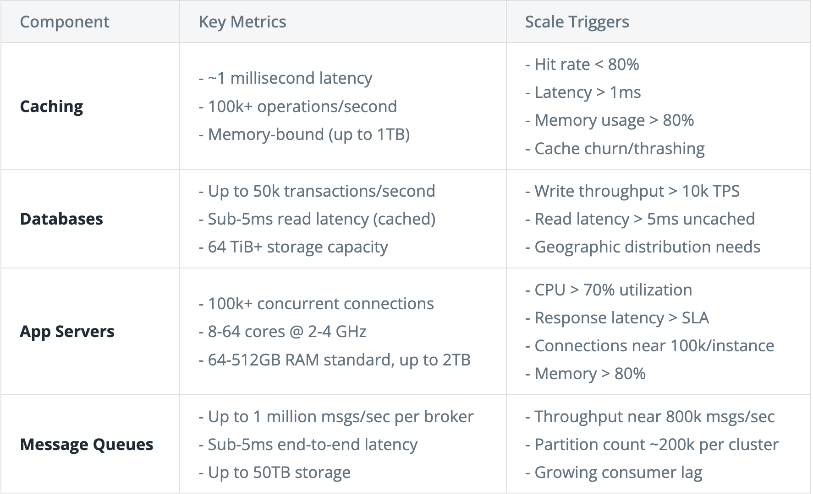
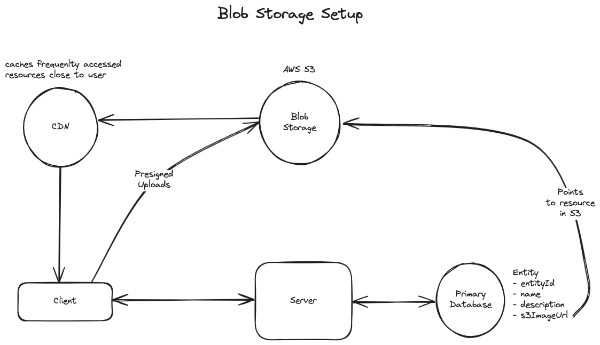

# System Design MMR (Minimum Memory Requirement)

## Delivery Framework



### Checklist for Non-Functional Requirements

Checklist of things to consider to identify the most important non-functional requirements for your system:

1. CAP Theorem: Should your system prioritize consistency or availability? Note, partition tolerance is a given in distributed systems.
2. Environment Constraints: Are there any constraints on the environment in which your system will run? For example, are you running on a mobile device with limited battery life? Running on devices with limited memory or limited bandwidth (e.g. streaming video on 3G)?
3. Scalability: All systems need to scale, but does this system have unique scaling requirements? For example, does it have bursty traffic at a specific time of day? Are there events, like holidays, that will cause a significant increase in traffic? Also consider the read vs write ratio here. Does your system need to scale reads or writes more?
4. Latency: How quickly does the system need to respond to user requests? Specifically consider any requests that require meaningful computation. For example, low latency search when designing Yelp.
5. Durability: How important is it that the data in your system is not lost? For example, a social network might be able to tolerate some data loss, but a banking system cannot.
6. Security: How secure does the system need to be? Consider data protection, access control, and compliance with regulations.
7. Fault Tolerance: How well does the system need to handle failures? Consider redundancy, failover, and recovery mechanisms.
8. Compliance: Are there legal or regulatory requirements the system needs to meet? Consider industry standards, data protection laws, and other regulations.

## Back of the Envelope Estimations

Back-of-the-envelope calculations are crucial for system design interviews. They help approximate key metrics and make informed architectural decisions. However, we do back-of-the-envelope calculations only when they have a direct impact on our design.

### Metrics

| Number                | Zeroes | Name        | Bytes Equivalent |
| --------------------- | ------ | ----------- | ---------------- |
| 1,000                 | 3      | Thousand    | 1 KB             |
| 1,000,000             | 6      | Million     | 1 MB (~1M B)     |
| 1,000,000,000         | 9      | Billion     | 1 GB (~1B B)     |
| 1,000,000,000,000     | 12     | Trillion    | 1 TB (~1T B)     |
| 1,000,000,000,000,000 | 15     | Quadrillion | 1 PB (~1Q B)     |

Formula:
`<x><x_unit> * <y><y_unit>`

Steps:

1. Multiply x and y (x\*y)
2. write #zeroes for x_unit, comma separated (every 3 zeroes)
3. write #zeroes for y_unit, comma separated (every 3 zeroes)
4. count #zeroes backwards 3 at a time and replace with combined unit

```
# Example:
how much space would 5 million 1 kb records take up?
5M * 1Kb => 5,000,000,000 = 5GB
```

### Numbers to know (2025)



### Latencies

| Action                                       | Time   | Comparison |
| -------------------------------------------- | ------ | ---------- |
| Reading 1MB sequentially from memory         | 0.25ms | -          |
| Reading 1MB sequentially from SSD            | 1ms    | 4x memory  |
| Reading 1MB sequentially from spinning disk  | 20ms   | 20x SSD    |
| Round trip network latency CA to Netherlands | 150ms  | -          |

### Storage

| Item                   | Size     |
| ---------------------- | -------- |
| 1 character (UTF-8)    | 1 byte   |
| 1 integer (4-byte int) | 4 bytes  |
| 1 float (double)       | 8 bytes  |
| 1 UUID                 | 16 bytes |

| Item                                                 | Size  |
| ---------------------------------------------------- | ----- |
| A two-hour movie                                     | 1GB   |
| A small book of plain text                           | 1MB   |
| A high-resolution photo                              | 1MB   |
| A medium-resolution image (or a site layout graphic) | 100KB |

### Business

| Metric                                      | Order of Magnitude |
| ------------------------------------------- | ------------------ |
| Daily active users of major social networks | 1B                 |
| Hours of video streamed on Netflix per day  | 100M               |
| Google searches per second                  | 100K               |
| Size of Wikipedia                           | 100GB              |

## Blob Storage Setup



**To upload**:

1. When clients want to upload a file, they request a presigned URL from the server.
2. The server returns a presigned URL to the client, recording it in the database.
3. The client uploads the file to the presigned URL.
4. The blob storage triggers a notification to the server that the upload is complete and the status is updated.

**To download**:

1. The client requests a specific file from the server and are returned a presigned URL.
2. The client uses the presigned URL to download the file via the CDN, which proxies the request to the underlying blob storage.

## Key Concepts & Technologies

### AWS API Gateway

> "AWS API Gateway supports authentication via built-in integrations like AWS Cognito, IAM policies, or even custom authentication through Lambda Authorizers. For user-facing apps, we'd typically use Cognito to issue JWT tokens, which API Gateway validates directly. For internal AWS services or server-to-server communication, IAM-based authentication is ideal. In scenarios with special or legacy authentication requirements, we'd implement a Custom Lambda Authorizer for flexible authentication logic."

## References

- Practice Latencies: https://computers-are-fast.github.io/
- How does a Database work? https://cstack.github.io/db_tutorial/
- Multipart Upload AWS S3: https://docs.aws.amazon.com/AmazonS3/latest/userguide/mpuoverview.html
